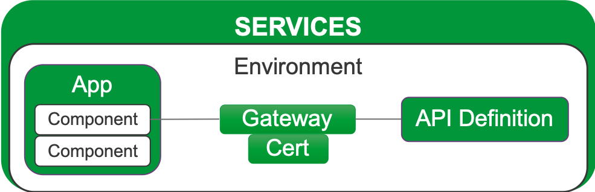
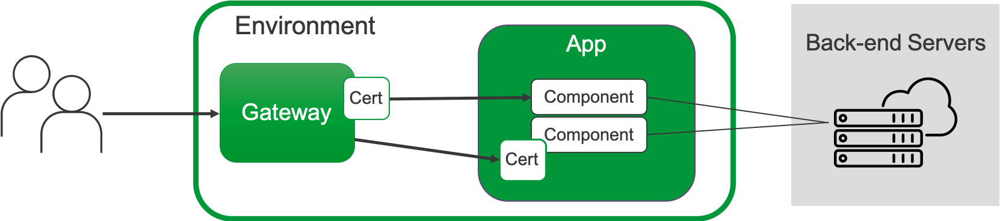
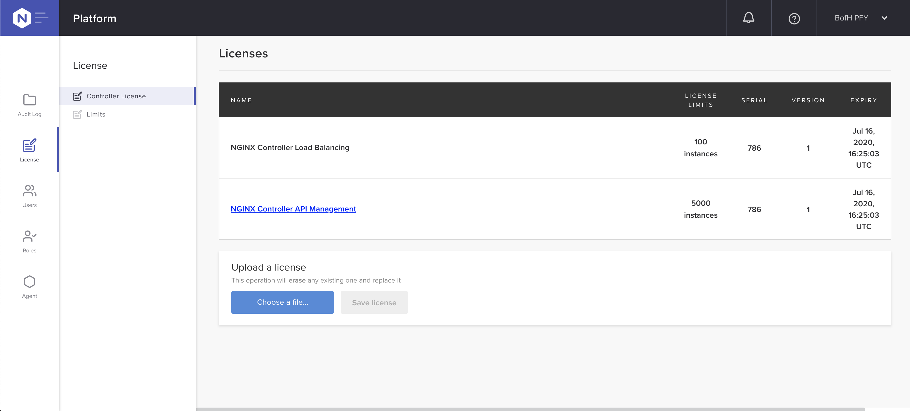
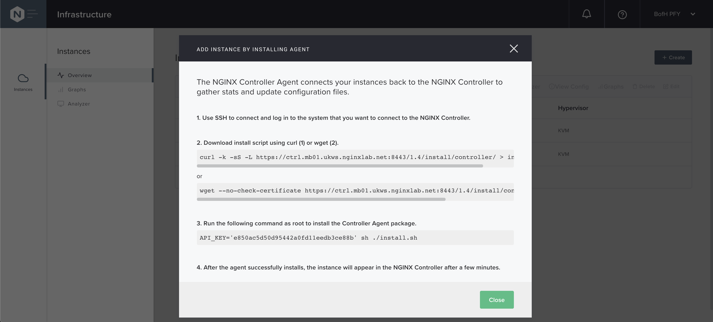

= Task 2: Install NGINX Controller
:showtitle:
:sectlinks:
:toc: left
:prev_section: task1
:next_section: task3
:source-highlighter: pygments

****
<<index.adoc#,Contents>> +
<<task1.adoc#,Previous Task>> +
<<task3.adoc#,Next Task>> +
****

== 2.1 Introduction
In this lesson we will be getting our hands dirty by deploying your NGINX Controller and some
NGINX Plus system using Ansible.  

NGINX Plus is already installed on your gateway node, and it acts as a simple TCP/UDP gateway for  
the services being deployed during this workshop

Remember the network layout looks like this:

image:../img/workshop-diagram.png[network,align="center"]

'''
== 2.2 Install the NGINX Controller collection
We publish Ansible roles for all NGINX products on Ansible Galaxy. You may use the roles individually or
acquire all of them as a collection. We'll use the roles to install NGINX Plus and NGINX Controller next.

First we need to install the collections using the `ansible-galaxy` tool.

.Controller Collection
----
$ ansible-galaxy collection install nginxinc.nginx_controller
----

.NGINX Core Collection
----
$ ansible-galaxy collection install nginxinc.nginx_core
----

The NGINX Core collection includes roles for installing and configuring NGINX Plus and NGINX App Protect.
At this time we don't include NGINX UNIT roles in the Core collection, but it is available seperately.

The published roles and collections can be found here: link:https://galaxy.ansible.com/nginxinc[NGINX Inc on Ansible Galaxy]

== 2.3 Install NGINX Controller

We're now going to be installing controller using the nginx_controller_install role included in the 
nginx_controller collection. 

Take a look at the playbook in `~/ansible/playbooks/controller/deploy_with_role.yaml`. This is a slightly
modified version of the example link:https://galaxy.ansible.com/nginxinc/nginx_controller_install[here] to
work with our lab.

The role itself is declaritive, but there are some additional tasks: we need to set a root password
before we run the role, because the installer needs to `su -` to root, and we also install some
package prerequisites, and copy the logfile after install completes.

The role section looks like this:

.Controller install snippet
[source,yaml]
----
- name: install controller
  remote_user: ubuntu
  hosts: controller
  become: yes
  become_user: ubuntu
  become_method: su  # note that the become method is required to be su, you will need to support that for your distribution.
  gather_facts: false
  vars_files:
    - ~/ansible/vars/controller.yaml

  roles:
    - nginxinc.nginx_controller.nginx_controller_install

  vars:
    - nginx_controller_tarball: "{{ controller.install_package }}"
    - nginx_controller_install_path: /home/ubuntu
    - nginx_controller_bundled_db: true
    - nginx_controller_tsdb_volume_type: local
    - nginx_controller_smtp_host: "localhost"
    - nginx_controller_smtp_authentication: false
    - nginx_controller_smtp_use_tls: false
    - nginx_controller_noreply_address: "noreply@example.com"
    - nginx_controller_fqdn:  "{{ controller.hostname }}"
    - nginx_controller_organization_name: "NGINX"
    - nginx_controller_admin_firstname: "{{ controller.admin_firstname }}"
    - nginx_controller_admin_lastname: "{{ controller.admin_lastname }}"
    - nginx_controller_admin_email: "{{ controller.admin_email }}"
    - nginx_controller_admin_password: "{{ controller.admin_password }}"
    - nginx_controller_self_signed_cert: true
    - nginx_controller_overwrite_existing_configs: true
    - ansible_python_interpreter: /usr/bin/python3
    - ansible_become_password: "{{ controller.su_password }}"
----

The `jinja2` variables `{{ foo }}` are loaded in from the vars_file in `~/ansible/vars/controller.yaml`

To install controller, change directory to you `~/ansible` and run the following command:

----
$ ansible-playbook playbooks/controller/deploy_with_role.yaml
----

The ansible-playbook will execute the controller install.sh script. If we were to be doing the install manually,
it would like something like the options below. A full list of the switches used by the installer can be seen by
running `./install.sh --help`.

The arguments can be passed via switches or environment variables, and when neither is present the installer will
ask interactively.

The playbook will install controller using the following options

----
./install.sh -y --smtp-host localhost --smtp-port 25 --smtp-authentication false --smtp-use-tls false \
  --noreply-address noreply@f5.com --admin-email {{ controller.admin_email }} \
  --admin-password {{ controller.admin_password }} \
  --fqdn {{ controller.hostname }} \
  --auto-install-docker --self-signed-cert --organization-name 'F5 - NGINX' \
  --admin-firstname {{ controller.admin_firstname }} \
  --admin-lastname {{ controller.admin_lastname }} \
  --tsdb-volume-type local --use-bundled-db --non-interactive
----

The install step can take upto 10 minutes, so lets have a chat about controller....

== 2.4 What is NGINX Controller

From NetOps to DevOps, modern app teams need a self‑service, API‑driven platform that integrates easily
into CI/CD workflows to accelerate app deployment – whether your app has a hybrid or microservices
architecture – and makes app lifecycle management easier.

image:../img/controller.png[Controller]

TIP: See the https://docs.nginx.com/nginx-controller/admin-guide/installing-nginx-controller/[Controller Admin Guide]
for more information

Execute the `ansible-playbook` and read through the next section while Ansible gets everything set up for you.

== 2.5 Controller Architecture

The controller platform is built using a microservice architecture. The installer sets up a local 
https://kubernetes.io[Kubernetes] cluster on the controller, and then deploys a number of containers and 
services within the K8's environment.

TIP: It is recommended that you allow the installer to installer and configure Docker and kubernetes 
for you, this is why they are not prerequisites.

The controller platform has been designed to be "API first" to enable the best integration coverage for
CI/CD orchestration. The API itself is declarative and Application Centric. Role Based Access Control
enables teams to be given access to the Applications they care about, and restricted or no access to the
ones they don't. The API is intuitively App Centric to enable developers to build logical pipelines easily,
and the analytics which controller collects are equally Application focused.

Currently the controller has Four core modules:

* <<Analytics>>
* <<API Management>>
* <<Load Balancing>>
* <<Controller Application Security>>

=== Analytics
The controller can be used as an analytics engine, either from an infrastructure perspective when not
managing NGINX configuration, or with an Application focus when used for ADC and/or API Management.

Controller can also provide valuble insights into NGINX based Service Mesh deployments.

=== API Management
The API Management module enables controller to act as a central management point for all of your
enterprises APIs. It supports Authentication, and Authorization of API consumers. It can import and
publish APIs from OAS 3.0 specifications, and can be used to manage a Developer Portal.

The APIM module has been designed to manage your full API life-cycle with an Application Centric
interface, and API first design.

=== Load Balancing
The Load Balancing module enables the central management of Load Balancer configuration for all of your NGINX+
deployments.

=== Controller Application Security

== 2.6 The Controller API

NGINX Controller follows an “API-first” approach, which means that all NGINX Controller functionality
is exclusively exposed through declarative and resource-oriented APIs. Even the user interface (UI) uses
our REST API!  
You’ll find examples of REST request bodies in the UI. You can rest assured that the example you see is
correct, because that is the call that the UI is going to make to apply your requested configuration.

=== Object Model

The NGINX Controller API - as well as the UI and the product documentation - is organized 
into four top-level areas:

 * Analytics: Enables data visualization for NGINX Controller.
 * Infrastructure: Lets you manage your NGINX Plus instances and certain aspects of the host machines on 
   which NGINX Controller and NGINX Plus instances run.
 * Platform: Lets you manage NGINX Controller options and configurations, including Users, Roles, Licenses,
   and Global Settings.
 * Services: Lets you manage your applications and APIs.

The diagrams below demonstrate how the different objects at the Service level relate to each other.
All Service objects are part of an Environment:

Gateways and Certs can be defined at the Environment level -or- at the App Component Level. 
The diagram below shows an example of how traffic flows through a Gateway to the App Components that 
represent your application’s back-end servers. Certs can be added to the Gateway or to an App Component.

=== Resource Properties

All NGINX Controller API resources contain the following properties:

----
{
  "metadata": {
  },
  "desiredState": {
  },
  "currentStatus": {
  }
}
----

The `desiredState` property is a representation of the state that you want to apply to the system.
The properties within `desiredState` are the API representation of data. While changes to `desiredState` may
trigger eventually consistent operations, the object itself is “immediately consistent”. Consumers of the API
can “read their own writes” and should always be able to retrieve the current desired state, no matter 
where the system is in the process of applying the state change.

The `currentStatus` property represents the current state of the system. Its purpose is to communicate the
progress of achieving eventual consistency to the API consumer. As such, currentStatus is a read-only property.

'''
== 2.8 Controller Licensing

++++

When the ansible playbook has finished, please log into your controller at 

++++

The user email address is `admin@nginx.com` and the password is saved in `~/secrets/controller.passwd`

You should see a warning that the controller is not yet licensed. There is a license file in the home folder
of your gateway machine, you can either upload it manually through the UI, or use Ansible to apply the license.

If you are using Ansible, you will find a `license.yaml` in the same location as the `deploy.yaml` run previously.

The NGINX button in the top left of the screen is the main navigation control for the UI. The licenses are in the
`platform` section, along with the RBAC settings (Users and Roles), and the audit log.

'''
== 2.9 Controller Agent

In the UI if you click the NGINX Button and change to the `Infrastructure` section, you will see a pop-up advising
you how to add an NGINX Plus instance.

As with the licensing above, there is an ansible playbook in the controller folder which can deploy agents to
your two NGINX Plus instances, you can either run the `deploy_nginx.yaml` playbook. Or follow the instructions
in the UI to install a controller agent onto both `nginx1` and `nginx2`.

I recommend you add the two nginx instances using the playbook, and once you have done that and they have
appeared in your infrastructure tab as instance 2 and 4, then add the gateway manually. In the next task we'll
deploy code to the managed instances 2 and 4, so it's important that those instances aren't your gateway
machine.

If the pop-up closes for any reason, you will find a `+ Create` button in the top right of the interface.

Within a few minutes of the instances being licensed you should see them appear in the overview section. We can
now view analytics for these nodes from an infrastructure perspective in the graphs section, and get a config
analysis from the Analyzer.

|===
|<<task1.adoc#,Previous Task>>|<<task3.adoc#,Next Task>> 
|===

