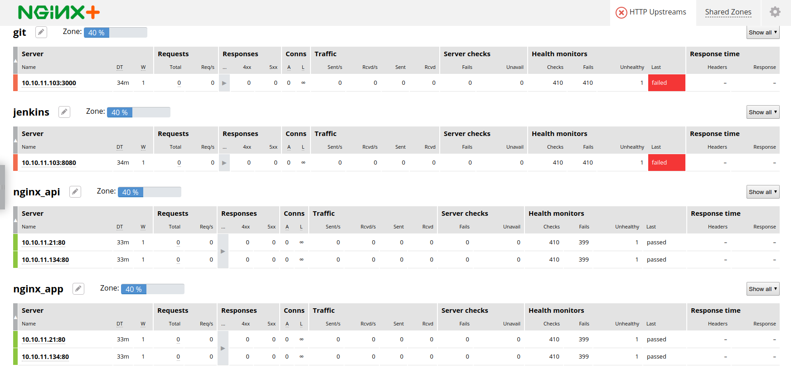

= Task 3: A Guided Tour of NGINX Plus and NGINX Controller
:showtitle:
:sectlinks:
:toc: left
:prev_section: task2
:next_section: task4
:source-highlighter: pygments

****
<<index.adoc#,Contents>> +
<<task2.adoc#,Previous Task>> +
<<task4.adoc#,Next Task>> +
****

== 3.1 What is NGINX Plus

Most people are familiar with the extremely popular NGINX Open Source project. NGINX runs most of
the worlds websites, and it is the most downloaded container on Docker Hub. You may not be aware
that NGINX also build a commercial version of NGINX which comes with additional features and an
enterprise support agreement. The commercial version is called NGINX Plus.

NGINX Plus provides many additional features in the data plane where it manages traffic, and also
includes some control plane functionality in the form of a REST API for _upstream_ management, a
key/valure store for dynamic ADC use-cases, and metrics collection.

NGINX Plus is required if you want to manage your NGINX instances with NGINX Controller, 
or utilize the NGINX App Protect WAF.

image:../img/app-platform.png[NGINX Application Platform]

Other NGINX Plus enhancements include:

 * Service Discovery using DNS SRV or A/AAAA records
 * JWT Support for OATH2 or OpenID Connect (OIDC)
 * ModSecurity WAF
 * App Protect WAF (Based on F5s market leading WAF technology)
 * Active Application Health Monitoring
 * Cache Management API
 * High Availability
 * Live Activity monitoring dashboard
 * Dynamic Configuration

NGINX Plus is used in many organizations for ADC/Load Balancing use-cases and also API Gateway.

'''

== 3.2 NGINX Plus Dashboard

The way we provide the _password_ for the _htpasswd_ module is a pattern which is used extensively
for password generation in this course. The _password_ is set using the Jinja lookup module.
The module will attempt to open the provided file and use its content as the password, but
if the file does not exist it will create a new password and store it there.

You should now be able to access your NGINX Plus dashboard, and API using the password created and stored
in your secrets folder and the username 'nginx'. Grab the password now:

----
$ cat ~/secrets/basic_auth.passwd
----

And then try to access these URLs (username is nginx):

++++

Try accessing your NGINX Plus dashboard ->  
Try accessing your NGINX Plus API ->  
Try accessing your NGINX Plus Swagger Spec -> 

++++

You will notice that the dashboard has many failed backends. This is because we haven't deployed them yet, and
the active health monitoring feature of NGINX Plus has detected them as failed.

You can keep an eye on the gateway dashboard as we deploy services to ensure that they are running correctly.

'''
== 3.3 Setup the NGINX backends

Okay, so we have NGINX Plus installed on the gateway machine and it's configured to serve content from our HTML
folder and to load balance onto the services we're going to deploy later. 

Before moving on lets run a final playbook to install NGINX Plus onto our backend NGINX instances (nginx1 
and nginx2). Please run:

----
$ cd ~/ansible
$ ansible-playbook playbooks/nginx_workshop_gw/install_backends.yaml
----

If you check back on your NGINX Plus dashboard you should see that the _nginx_api_, _nginx_app_, and 
_nginx_web_ upstream zones become healthy as they begin responding to the health probes.

In the next task we'll install our CI/CD platform so that we can automate deployments to our new NGINX
servers.

|===
|<<task1.adoc#,Previous Task>>|<<task3.adoc#,Next Task>> 
|===

