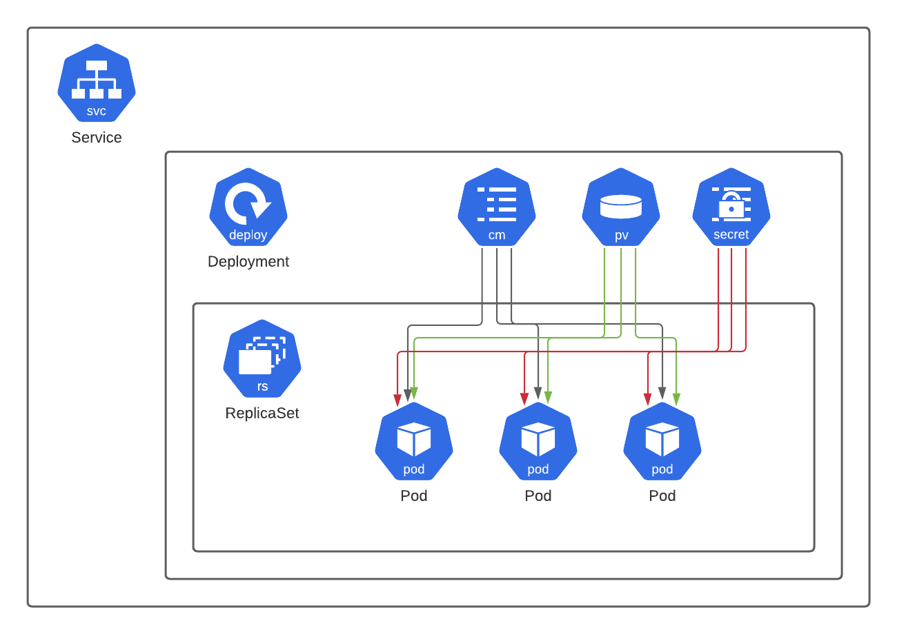
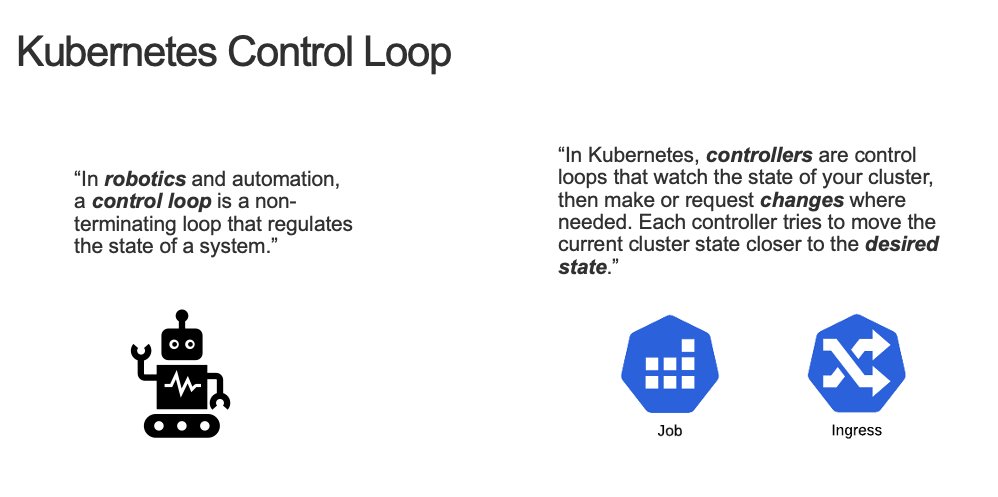
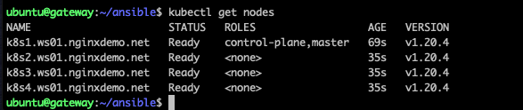

= Task 2: Deploy Kubernetes
:showtitle:
:toc: left
:sectlinks:
:prev_section: task1
:next_section: task3
:source-highlighter: pygments

****
<<index.adoc#,Contents>> +
<<task1.adoc#,Previous Task>> +
<<task3.adoc#,Next Task>> +
****

== 2.1 Introduction

Kubernetes has become the defacto container orchestration system. All of the main cloud providers have a PaaS offering
based on Kubernetes, and RedHat OpenShift is one of the most popular enterprise distributions, for use both on premise
and in public cloud environments.

At the heart of the different variants of Kubernetes is the Kubernetes API Server. It is the flexibility and the extensibility
of the Kubernetes (K8s) API that has helped it win out over other platforms. In fact you'll see during this course how 
vendors like F5/NGINX make good use of that extensibility to provide greater control of advanced extensions with Custom Resources.

=== Terminology

When you want to run a workload on Kubernetes, you generally create a `deployment`. The deployment describes the application
by specifying the required `containers`, but it also includes `meta-data` (including `name`, `namespace`, and `labels`),
additional configuration through `annotations`, `env` (environment variables), `secrets`, and `config-maps` can be provided.
Deployments can also be assigned shared file-systems through `Persistent Volumes` and `Persistent Volume Claims`. Often `volumes`
are used to mount `config-maps` into a `pod` as a file-system mount too.

The `pod` is the smallest element of compute the Kubernetes deals with. Your `deployment` will specify a number of `replicas`
which equates to the number of `pods` that get deployed. The pod is a single compute instance and can be made up from one or many
containers. At least one of those containers will be persistent and run the application, but some may be short-lived or ephemeral.
It's quite common for complex applications to use one or more `init-containers` which are there to setup the environment ready for
the main task.

The `deployment` is the common interface used to create a `replicaSet`, and the `pods` it manages. It provides support for scaling,
rolling-updates, and other application life cycle functions. Applications can also be deployed as `daemonSets` which enable you to
create a pod on each eligible Kubernetes node, or `statefulSets` which give you more control over how the pods are deployed and named.

****
The `DaemonSet` is a common pattern used for cluster services, and is often employed with `Kubernetes Ingress Controllers`. The NGINX
KIC can be deployed in this way, but we also support the standard `deployment` model.
****

When you want to make a deployment accessible to others, either internally or externally, then you create a `service`.
A Kubernetes `service` can be of several types: `ClusterIP`, `NodePort`, `LoadBalancer`, or `ExternalName`. If you
are creating a `service` for consumption within the kubernetes cluster, then `ClusterIP` is generally used. It's also
used in some cloud environments where the Kubernetes pod network is directly routable from external services.
A `NodePort` service assigns a port on the kubernetes node and a route is created to the `pods` for traffic hitting
that port. A `LoadBalancer` type is used in cloud environments for automatically assigning a cloud load balancer to the service.

Kubernetes also makes heavy use of `labels` and `selectors` for linking different objects. It's common practice for
a `service` to use `selectors` to find the `deployment` and `pods` which it has been created to publish.

== 2.2 Kubernetes Components

In this section, we'll be deploying a 4 node Kubernetes cluster, but first lets have a look at the K8s Components.

image:../img/k8s-components.svg[Kubernetes Components]

Kubernetes provides a control plane for managing the lifecycle of containerized applications. At the heart
of the systems is the Kubernetes API, which provides the communications channel between all k8s components and the
end users.

* The etcd database is used as the key/value store for keeping track of all k8s data
* The kube-scheduler watches for new pods, and finds a node on which they can be scheduled
* The kube-controller manager is responsible for managing built-in `controllers`
* The cloud-controller manager is a cloud-specific manage for cloud related `controllers`
* kubelet is the agent on each node which actually runs and looks after your containers.
* kube-proxy manages the networking for the containers

The Kubernetes API is a collection of loosely coupled resource specifications. A `deployment`, a `service`, an `Ingress`
are all examples of resources which are registered in the K8s API. When you create one of these resources, it is a
`controller` which detects the CRUD request and takes appropriate action.

****
Interestingly one of the common resources `Ingress` doesn't come with a `controller` out of the box. More on that later.
****

== 2.3 Setup Kubernetes

We're going to deploy Kubernetes across 4 nodes running in the private network. The node_setup playbook you
just ran has assigned host names to them as 'k8s1, k8s2, k8s3, and k8s4'. Now we're going to install `docker` and
the kubernetes packages: `kubeadm`, `kubectl` and `kubelet`.

Please run the deployment playbook

----
$ cd ~/ansible
$ ansible-playbook playbooks/kubernetes/deploy.yaml
----

We've installed `docker` as our container runtime. The `kubeadm` package is a tool for managing Kubernetes clusters,
the `kubectl` command is the tool we'll be using most during the course and it's job is to help us interact with
the kubernetes API. Finally `kubelet` is the kubernetes node agent, it runs on each node in the cluster to manage
the containers (both our containers, and the kubernetes system itself).

The other kubernetes components, such as kube-proxy, etcd, the api server, etc are all launched as containers

The next task in deploying a kubernetes cluster is to setup the 'primary' node.

----
$ cd ~/ansible
$ ansible-playbook playbooks/kubernetes/setup_primary.yaml
----

The above playbook uses `kubeadm` to create a new cluster, and then sets up the control plane components. Then we deploy a
CNI for the pod networks (we're using flannel for simplicity), finally it retrieves and saves the API tokens which we'll
need to join our other nodes into the cluster.

Next we use the join command we retrieved from the primary node, to link our other hosts into the kubernetes cluster

----
$ cd ~/ansible
$ ansible-playbook playbooks/kubernetes/setup_nodes.yaml
----

Finally we'll install the `kubectl` command on your gateway, and copy over the authentication keys from the primary
node:

----
$ cd ~/ansible
$ ansible-playbook playbooks/kubernetes/setup_local.yaml
----

You should know have a Kubernetes cluster installed in your lab environment, and we should be able to interact with it
from the command line. Try executing `kubectl get nodes` in your shell. You should see output similar to:

Now let's move on to <<task3.adoc#,Task 3>> 

|===
|<<task1.adoc#,Previous>>|<<task3.adoc#,Next Task>>
|===

