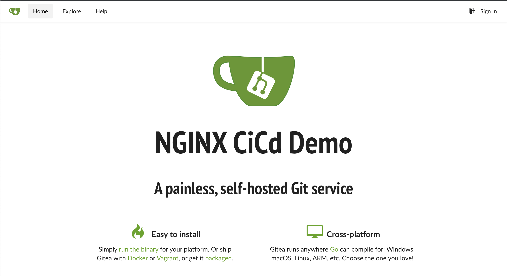

= Task 3: Setup our container registry and Git server
:showtitle:
:toc: left
:sectlinks:
:prev_section: task2
:next_section: task4
:source-highlighter: pygments

****
<<index.adoc#,Contents>> +
<<task2.adoc#,Previous Task>> +
<<task4.adoc#,Next Task>> +
****

== 3.1 Container Registries

So we now have a functioning K8s cluster, we're good to go right???

Well almost. If we want to publish our own applications, then we could build containers and upload them to a 
public container registry, but what if the application contains our sensitive Intellectual Property (IP), or
it's licensable software (like NGINX Plus for example)? In that case it's preferable to run our own container
registry.

In the next task, we'll build and upload an NGINX Plus Ingress Controller for Kubernetes, but first we need
to create a docker registry server to host it for us.

== 3.2 Setup the docker registry

Setting up a docker registry is as simple as executing:

----
$ docker run -d -p 5000:5000 registry:2
----

This instructs docker to launch a version 2 registry container `registry:2` and publish the registry service on
port 5000 `-p 5000:5000`, and run the container detached.

The above is fins for testing, and would certainly work for this lab. But we're going to set the bar a little higher
for our repository. We're going to provide a few additional options to enable TLS, setup basic authentication, and
store the images on a mounted volume.

----
$ docker run -d -p 5000:5000 --restart=always --name registry \
    -v /home/docker/certs:/certs \
    -v /home/docker/auth:/auth \
    -v /home/docker/registry:/var/lib/registry \
    -e REGISTRY_AUTH=htpasswd \
    -e REGISTRY_AUTH_HTPASSWD_REALM=PrivateRepo \
    -e REGISTRY_AUTH_HTPASSWD_PATH=/auth/htpasswd \
    -e REGISTRY_HTTP_TLS_CERTIFICATE=/certs/domain.crt \
    -e REGISTRY_HTTP_TLS_KEY=/certs/domain.key \
    registry:2
----

We're not going to run either of those commands manually, we have a playbook to do it for us. So can you now run
the following playbook

----
$ cd ~/ansible
$ ansible-playbook playbooks/cicd/docker-registry.yaml
----

That will setup our local registry on the `cicd1` node. Now lets confirm that docker is working. Ansible will have 
generate a password and stored it under `/home/ubuntu/secrets/docker.cicd.passwd`. The username is `nginx`.

[#doc_login]
----
$ docker login registry.<domain>:5000
----

++++

++++

== 3.3 Setup our Git Repo

We have one last task in this section and that's to deploy our git server, we'll use this to checkout application code
later, but first we need to deploy the service. Again, we'll let Ansible do this for us. Please run the following playbook:

----
$ cd ~/ansible
$ ansible-playbook playbooks/cicd/gitea.yaml
----

You should now be able to access your Gitea server at `https://git.<yourdomain>`

++++

Try accessing your Gitea Service -> 

++++

Check that you can login using the username _ngnix_ and the password found in `~/secrets/git.cicd.passwd`

Now let's move on to <<task4.adoc#,Task 4>> 

|===
|<<task2.adoc#,Previous>>|<<task4.adoc#,Next Task>>
|===

