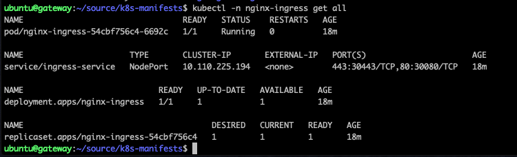

= Task 5: Deploy the Kubernetes Ingress Controller
:showtitle:
:toc: left
:sectlinks:
:prev_section: task4
:next_section: task6
:source-highlighter: pygments

****
<<index.adoc#,Contents>> +
<<task4.adoc#,Previous Task>> +
<<task6.adoc#,Next Task>> +
****

== 5.1 Ingress is Rubbish

== 5.2 Custom Resource Definition

Back on your gateway machine, where you have your kubectl setup and ready to talk to your K8s cluster, we're going
to check out the NGINX KIC source again, so that we can upload the manifests for our Custom Resource Definitions

----
$ cd ~/source 
$ git clone https://github.com/nginxinc/kubernetes-ingress.git
$ cd kubernetes-ingress/deployments
----

This is the deployments folder, it includes a bunch of Custom Resources for extending the Kubernetes API, and 
enabling you to access more of the NGINX KIC functionality, in a way that can be validated by the K8s API.

The following four CRDs provide advanced load balancing configuration for HTTP and non-HTTP services. The `VirtualServer`
and `VirtualServerRoutes` are used in HTTP(S) deployments, and can also references `Policies` for applying rate shaping,
and other reusable elements. The `TransportServer` provides support for other TCP/UDP services, and is used in conjunction
with the `GlobalConfiguration` for opening the TCP/UDP ports used.

----
$ kubectl apply -f common/crds/k8s.nginx.org_virtualservers.yaml
$ kubectl apply -f common/crds/k8s.nginx.org_virtualserverroutes.yaml
$ kubectl apply -f common/crds/k8s.nginx.org_policies.yaml
$ kubectl apply -f common/crds/k8s.nginx.org_transportservers.yaml
$ kubectl apply -f common/crds/k8s.nginx.org_globalconfigurations.yaml
----

The next set of CRDs we're going to apply provide support for NGINX App Protect WAF. There's a resource for managing
logging: `APLogConf`, one for building security policy: `APPolicy`, and one for user signatures: `APUserSig`

----
$ kubectl apply -f common/crds/appprotect.f5.com_aplogconfs.yaml
$ kubectl apply -f common/crds/appprotect.f5.com_appolicies.yaml
$ kubectl apply -f common/crds/appprotect.f5.com_apusersigs.yaml
----

== 5.3 Setup the Ingress Controller namespace

It's time. We're finally (almost) going to deploy an NGINX Ingress Controller :-)

We're going to need a `namespace`, so first we'll use the example from the docs called `nginx-ingress`, we'll also
create a service account, and apply some RBAC rules to allow the Ingress Controller to watch both standard `Ingress`
resources, and our own `Custom Resources`.

----
$ kubectl apply -f common/ns-and-sa.yaml
$ kubectl apply -f rbac/rbac.yaml
$ kubectl apply -f rbac/ap-rbac.yaml
----

We'll also create a default SSL certificate and private key and some empty place holder configmaps

----
$ kubectl apply -f common/default-server-secret.yaml
$ kubectl apply -f common/nginx-config.yaml
$ kubectl apply -f common/global-configuration.yaml
$ kubectl apply -f common/ingress-class.yaml
----

== 5.4 Deploy the controller

We've pushed the NGINX Ingress Controller to our private repository, so the next thing we need to do is give kubernetes
access to it. We do that by creating a kubernetes `secret` from the docker config at `/home/ubuntu/.docker/config.json`.

If you open the file `~/source/k8s-manifests/docker-secret.yaml` you'll see a docker secret with a place holder just waiting
for us to provide the secret. We can do that with a little `sed`.

----
$ cd ~/source/k8s-manifests
$ dockerconfig=$(cat /home/ubuntu/.docker/config.json | base64 -w 0)
$ sed -i -re "s/YOUR_SECRET/$dockerconfig/" docker-secret.yaml
$ kubectl -n nginx-ingress apply -f docker-secret.yaml
----

That last line used `kubectl` to deploy a new secret called `registry` into the `nginx-ingress` namespace.

Now, let's deploy the NGINX KIC

----
$ kubectl apply -f nginx-ingress/10-deploy-kic.yaml
$ kubectl apply -f nginx-ingress/11-deploy-kic-service.yaml
----

You should now have an NGINX Ingress Controller deployed.

== 5.5 Monitoring Hints

Before we get into the bones of the workshop, I'm going to let you into a secret. The NGINX gateway which you are connecting
to is also running NGINX Plus, and it has the NGINX Plus dashboard enabled.....

=== NGINX Dash

++++

Try accessing your NGINX Plus dashboard ->  
Try accessing your NGINX Plus API ->  
Try accessing your NGINX Plus Swagger Spec -> 

++++

=== NGINX KIC logs

----
$ kubectl -n nginx-ingress logs deployment.apps/nginx-ingress -f
----

Now let's move on to <<task6.adoc#,Task 6>> 

|===
|<<task4.adoc#,Previous>>|<<task6.adoc#,Next Task>>
|===

