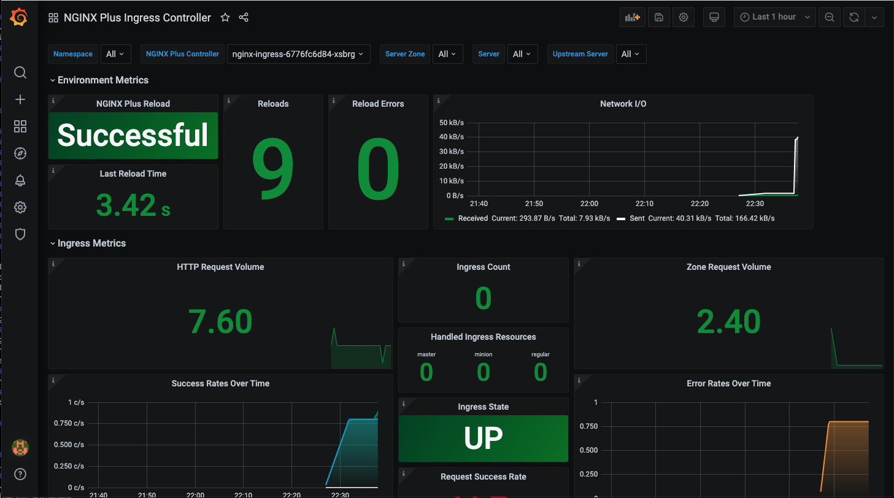

= Task 6: Playtime
:showtitle:
:toc: left
:sectlinks:
:prev_section: task4
:next_section: task6
:source-highlighter: pygments

****
<<index.adoc#,Contents>> +
<<task5.adoc#,Previous Task>> +
<<task7.adoc#,Next Task>> +
****

== 6.1 Deploy some monitoring

Most Kubernetes Knights, like NGINX Ninjas, and F5 Frequent Flyers enjoy the majesty of a properly configured monitoring
solution. In Kubernetes land, the most common tool for that sort of thing is Prometheus.

NGINX KIC has native support for prometheus, so it would seem rude not to deploy some. First let's set a grafana password,
we'll use the same one basic auth password from `~/secrets/basic_auth_passwd`

----
$ grafpass=$( cat ~/secrets/basic_auth.passwd )
$ sed -i -re "s/_PASSWORD_/'$grafpass'/" monitoring/04_grafana_deploy.yaml
----

Once we've set that, we'll deploy the monitoring stuff.....

----
$ kubectl apply -f monitoring/01_namespace.yaml
$ kubectl apply -f monitoring/02_configmap_prom.yaml
$ kubectl apply -f monitoring/02_configmap_graf.yaml
$ kubectl apply -f monitoring/03_prom_deploy.yaml
$ kubectl apply -f monitoring/04_grafana_deploy.yaml
$ kubectl apply -f monitoring/06_vservers.yaml
----

++++

time to hit up <a id='graf_link'>https://graf.your.fqdn/</a> and login as "admin" with your basic auth password.

++++

Lovely....... What it didn't work? Well it works for me ;-)

Actually, here's the thing...... we're done with the whole ansible automation thing now. You're here to learn Kubernetes,
and well it's about time you started doing some of this stuff yourself. In each of the applications we're going to deploy
from here in, you'll likely have to change some host names in the `Ingress` and/or `VirtualServer` resources to match the
names in your workshop.

Open the `monitoring/06-vservers.yaml` file in your editor of choice. The file contains two `VirtualServer` resources, the
first one is for prometheus and looks like this:

[source,yaml]
----
apiVersion: k8s.nginx.org/v1
kind: VirtualServer
metadata:
  name: prometheus-ingress
  namespace: monitoring
spec:
  host: "prom.foo.bar"
  upstreams:
  - name: web9090
    service: prometheus-service
    port: 9090
  routes:
  - path: /
    action:
      pass: web9090
----

++++

You'll need to change the "host" line to match your workshop domain, <a id='prom_link'>https://prom.your.fqdn/</a>, and
do the same for the grafana entry too, only that one should be <a id='graf2_link'>https://graf.your.fqdn/</a>.

++++

Once you've fixed those two lines, you only need to apply the vservers manifest again to fix everything.

----
$ kubectl apply -f monitoring/06_vservers.yaml
----

Now try that again.

== 6.2 What Cheese

Now we're going to look at the demo app... change to the whatcheese directory and have a look at the manifests.

Lets start up the application, but deploying some of the manifests....

----
$ kubectl apply -f 01-namespace.yaml
$ kubectl apply -f 10-whatcheese-web.yaml
$ kubectl apply -f 11-whatcheese-db.yaml
$ kubectl apply -f 12-whatcheese-api.yaml
$ kubectl apply -f 13-whatcheese-web-v2.yaml
$ kubectl apply -f 15-ingress.yaml
----

That is whatcheese running, and exposed using a standard `Ingress Resource`.

++++

Try access the WhatCheese website now at <a id='cheese_link'>https://www.your.fqdn/</a>.

++++

Did you remember to check that the host name matches your workshops FQDN?

== 6.3 The Ingress Resource

If you take a look at the file `15-ingress.yaml` you can see that this is an example of a standard Ingress resource.
The spec section contains information on the `host` and routing based on the `path`. This particular example enables
a WAF policy, and sets the load balancing method through annotations.

[source,yaml]
----
---
apiVersion: extensions/v1beta1
kind: Ingress
metadata:
  name: www-whatcheese-web-ingress
  namespace: cheese-demo
  annotations:
    appprotect.f5.com/app-protect-enable: "True"
    appprotect.f5.com/app-protect-policy: "nginx-ingress/dataguard-blocking"
    nginx.org/lb-method: "round_robin"
spec:
  rules:
  - host: "www.ws01.nginxdemo.net"
    http:
      paths:
      - path: /
        backend:
          serviceName: whatcheese-web-v2
          servicePort: 80
----

As stated before, the Kubernetes API has no information about the annotations and they will not be validated
by the K8s. The NGINX KIC will validate the settings later and refuse to apply a config with broken annotations,
but you have to discover the failure out-of-pipeline, by checking the KIC status.

Try changing the `lb_method` to "foo" or something else invalid and applying the manifest. The `kubectl` command
does not report the error. But NGINX will reject the configuration.

****
More information on the available annotations can be seen on  
link:https://docs.nginx.com/nginx-ingress-controller/configuration/ingress-resources/advanced-configuration-with-annotations/[docs.nginx.com]
****

Remove the `Ingress` resource from Kubernetes by running

----
$ kubectl delete -f 15-ingress.yaml
----

== 6.4 Custom Resource Definitions

Take a look at the files `15-virtualserver-1.yaml` and `15-virtualserver-2.yaml`. 

They both contain VirtualServer resources for an `API` and `WWW` endpoint. The second example is the more interesting
one it creates a `canary` access to version 2 of the website, and restricts write access to the API endpoint with a 
pre-shared-key.

[source,yaml]
----
---
apiVersion: k8s.nginx.org/v1
kind: VirtualServer
metadata:
  name: api-whatcheese-web-vs
  namespace: cheese-demo
spec:
  host: "api.ws01.nginxdemo.net"
  upstreams:
  - name: apiv1
    service: whatcheese-api
    port: 80
  routes:
  - path: /
    action:
      pass:  apiv1
  - path: /v1/add
    matches:
    - conditions:
      - argument: psk
        value: superSecretKey
      action:
        pass: apiv1
    action:
      return:
        code: 200
        type: application/json
        body: |
          {\"result\": \"ERROR\", \"details\": \"Please provide the Super Secret Key in the psk field\"}
---
apiVersion: k8s.nginx.org/v1
kind: VirtualServer
metadata:
  name: www-whatcheese-web-vs
  namespace: cheese-demo
spec:
  host: "www.ws01.nginxdemo.net"
  upstreams:
  - name: webv1
    service: whatcheese-web
    port: 80
  - name: webv2
    service: whatcheese-web-v2
    port: 80
  routes:
  - path: /
    matches:
    - conditions:
      - cookie: austin
        value: yeahBabyYeah
      action:
        pass: webv2
    action:
      pass:  webv1
----

****
You have probably wondered at times "What ever happened to Austin Powers?". I know I used to wake up in a panic every
other Thursday with exactly that question on my mind. It turns out he got a job as a developer for WhatCheese.
****

If you hit the website with a cookie called `austin` with the value `yeahBabyYeah`, then you get access to new
versions of the site. You can see we're doing routing based on the cookie value, and because this is a CRD it's
right there in the resource spec. That means this whole example is validated by the Kubernetes API.

Apply the second VirtualServer resource, and try to access the `Canary` version of the website.

----
$ kubectl apply -f 15-virtualserver-2.yaml
----

The new version of the site includes a form to upload new cheeses, but write access is protected by that PSK.
Try to upload a new cheese.

|===
|<<task5.adoc#,Previous>>|<<task7.adoc#,Next Task>>
|===
