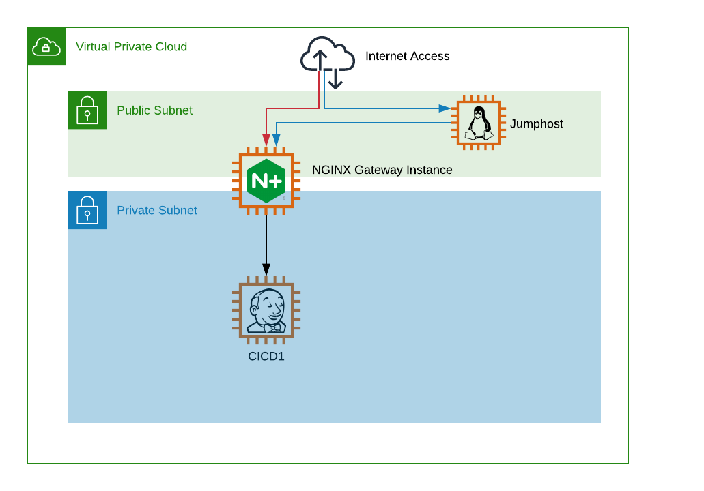

= Task 0: Welcome to the workshop
:showtitle:
:sectlinks:
:toc: left
:prev_section: index
:next_section: task1
:source-highlighter: pygments

****
<<index.adoc#,Contents>> +
<<index.adoc#,Previous Task>> +
<<task1.adoc#,Next Task>> +
****

== 0.1 Introduction

Welcome to this NGINX 101 workshop. 

First lets take a look at the environment you'll be working with.

Each individual in the workshop has been given access to a gateway instance, the gateway is multi-homed
with a public interface in a routable public network, and a secondary interface in a private network.

You can either access the gateway directly using SSH and HTTPS, or if that is restricted you may access
using RDP to the jump-host. The RDP password is the same as the Basic-Auth password used to access this
site, and the username is `ec2-user`.

All other machines in the course reside in the private network and will be accessed through the NGINX
Plus instance running on the gateway. In this 101 course, we'll be running everything on the cicd1 host.

If you're reading this then the gateway itself is already setup, and your instructor has supplied you
with it's hostname and password.

== 0.2 Getting Access

=== 0.2.1 Direct Access
The private key for gaining access to your workshop can be downloaded link:/secrets/[Here]
You should find the SSH private key in both OpenSSH PEM and Putty PPK file formats.

=== 0.2.2 Jumphost Access
Your jump-host should be accessible on the same stack number as this gateway. So for example,
If you are on stack ws03.domain.com, then your jump-host will be on jump03.domain.com.  

Connect using your RDP client, with the username `ec2-user` and the same password as you used here.

== 0.3 Begin
Once you have both HTTPS and SSH access to the workshop please continue with <<task1.adoc#,Task 1>>

|===
|<<index.adoc#,Contents>>|<<task1.adoc#,Next Task>> 
|===

