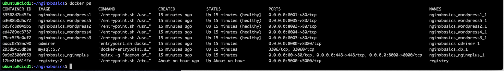

= Task 2: Deploy the demo environment
:showtitle:
:toc: left
:sectlinks:
:prev_section: task1
:next_section: task3
:source-highlighter: pygments

****
<<index.adoc#,Contents>> +
<<task1.adoc#,Previous Task>> +
<<task3.adoc#,Next Task>> +
****

== 2.1 Introduction

The ansible playbook we executed in the previous task deployed docker onto the `cicd1` host. Now we'll be deploying our 
services into that docker environment. We're not going to cover docker in any great detail on this course, but we go into a lot
more detail on container deployments in the Kubernetes workshop. So, if you would like to learn more about containers and
micro-services then please sign up for the `Kubernetes Ingress Controller` workshop.

NGINX is a light weight `webserver`, `reverse-proxy` and `load-balancer`. It can be deployed on anything from big iron Linux
servers, to virtual machines, to tiny container instances. Heck, it'll even run on your Raspberry Pi.

In this workshop we'll be using the enterprise version of NGINX, NGINX Plus in a docker container.

== 2.2 What is NGINX Plus

Most people are familiar with the extremely popular NGINX Open Source project. NGINX runs most of
the worlds websites, and it is the most downloaded container on Docker Hub. You may not be aware
that NGINX also build a commercial version of NGINX which comes with additional features and an
enterprise support agreement. The commercial version is called NGINX Plus.

NGINX Plus provides many additional features in the data plane where it manages traffic, and also
includes some control plane functionality in the form of a REST API for _upstream_ management, a
key/valure store for dynamic ADC use-cases, and metrics collection.

NGINX Plus is required if you want to manage your NGINX instances with NGINX Controller,
or utilize the NGINX App Protect WAF.

image:../img/app-platform.png[NGINX Application Platform]

Other NGINX Plus enhancements include:

 * Service Discovery using DNS SRV or A/AAAA records
 * JWT Support for OATH2 or OpenID Connect (OIDC)
 * ModSecurity WAF
 * App Protect WAF (Based on F5s market leading WAF technology)
 * Active Application Health Monitoring
 * Cache Management API
 * High Availability
 * Live Activity monitoring dashboard
 * Dynamic Configuration

NGINX Plus is used in many organizations for ADC/Load Balancing use-cases and also API Gateway.

== 2.3 NGINX Plus keys

NGINX Plus is commercially licensed software, but it does not use a license file. Instead we protect access to the NGINX Plus
packages using mutual TLS. The gateway instance that you are connected to is running NGINX Plus and the host operating system
package manager has been configured to use TLS keys when accessing the NGINX Plus repo.

We need to copy the TLS key pair to `cicd1` so that we can build and deploy our NGINX Plus container. So let's do that now:

----
$ scp /etc/ssl/nginx/nginx-repo.* cicd1:
----

== 2.4 Deploy the lab environment

Now we have the keys on the `cicd1` machine running our docker environment, we can ssh over there and deploy the stack using
`docker compose`. First we'll ssh over to `cicd1` and clone the `nginxbasics` repository.

----
$ ssh cicd1
$ git clone https://github.com/nginxLeif/nginxbasics.git
$ cd nginxbasics
$ mkdir nginxplus/certs
$ mv ../nginx-repo.* nginxplus/certs/
----

Once cloned, and our nginx-repo certificates have been copied into the correct location, we should be good to deploy our
docker stack using compose... Let's try:

----
$ chmod +x wordpress/entrypoint.sh
$ docker-compose up -d
----

Some text should scroll through your terminal as the `docker-compose` tool builds and then deploys our NGINX Plus,
MySQL, and Wordpress containers.

=== 2.4.a modifying the lab

****
The NGINX Basics repository is built to run locally on a laptop, so feel free to make a note of the `github` address for
link://github.com/nginxLeif/nginxbasics[Leifs NGINX Basics workshop] and then you can use the lab guide included there
to run these labs again on your own at another time.
****

The version on github expects you to be running locally and using the hostname `wp.nginx.local`, so we need to adjust that
for our hosted environment. So, please run the following command:

[#sed1]
----
$ sed -i -re 's/wp.nginx.local/www.< wsid >.< domain >/g' runinterminal.bat
----

++++

++++

== 2.5 Finishing the setup

Once the docker compose has completed, and you've run the `sed` script above to fix the hostnames for this workshop,
confirm that docker has started our containers by executing `docker ps`. You should see output similar to below:

Now, we're ready to update wordpress. Please run the `runinterminal.bat` script:

----
$ sudo bash runinterminal.bat
----

In our environment we have several running containers now, the important ones are:

* nginxbasics_nginxplus_1
* nginxbasics_wordpress1_1
* nginxbasics_wordpress2_1
* nginxbasics_wordpress3_1
* nginxbasics_wordpress4_1
* nginxbasics_wordpress5_1

There is also a mysql database container and a couple of supporting containers we need not concern
ourselves with for the purposes of this workshop.
The WordPress instances are accessible directly from the `cicd1` host using the following URLs:

The WordPress instances are accessible directly from the host using the following URLs:

1. http://cicd1:8001
2. http://cicd1:8002
3. http://cicd1:8003
4. http://cicd1:8004
5. http://cicd1:8005

++++

The NGINX Plus container is accessible directly from your browser using the following URL:

++++

Currently you'll see an error from the gateway, because we haven't configured NGINX yet.

Now let's move on to <<task3.adoc#,Task 3>> 

|===
|<<task1.adoc#,Previous>>|<<task3.adoc#,Next Task>>
|===

