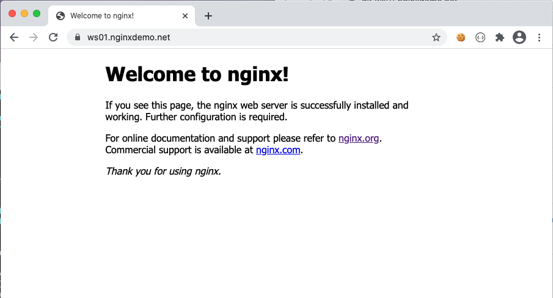

= Task 4: NIGNX Web Server
:showtitle:
:toc: left
:sectlinks:
:prev_section: task3
:next_section: task5
:source-highlighter: pygments

****
<<index.adoc#,Contents>> +
<<task3.adoc#,Previous Task>> +
<<task5.adoc#,Next Task>> +
****

== 4.1 NGINX Web Server

Using the editor of your choice, both `vim` and `nano` are installed on the `cicd1` machine. eg:

----
$ sudo nano nginxplus/config/default.conf
----

With the contents:

----
server {
  listen 80;
  location / {
    root /usr/share/nginx/html;
    index index.html;
  }
}
----

Make sure to reload the configuration after saving the file

----
$ sudo docker exec nginxbasics_nginxplus_1 nginx -t
$ sudo docker exec nginxbasics_nginxplus_1 nginx -s reload
----

== 4.2 About the config

The above config defines a virtual server, telling it to listen to port 80 on any interface (*:80,
0.0.0.0:80), and sets up a location matching block using a prefix match for "/". When a request
comes in on port 80 that is matched by the prefix of "/" we will serve content from disk, starting
from the `/usr/share/nginx/html` directory. If no specific resource is requested, we will attempt to
deliver a resource named index.html.

++++

Open your browser and navigate to  and verify that you see a result similar to
this

++++

Now let's move on to <<task5.adoc#,Task 5>> 

|===
|<<task3.adoc#,Previous>>|<<task5.adoc#,Next Task>>
|===

