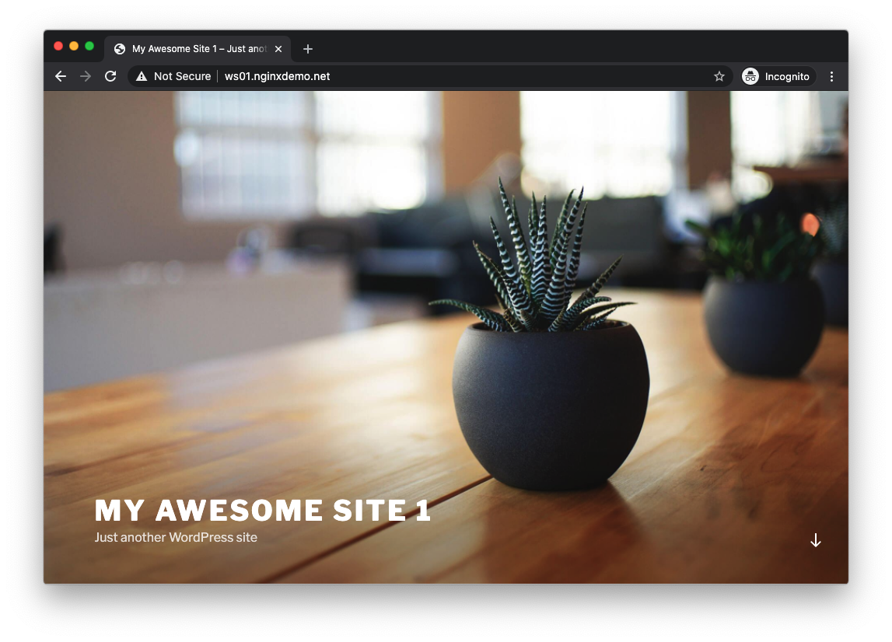

= Task 5: Reverse Proxy and Load Balancing
:showtitle:
:toc: left
:sectlinks:
:prev_section: task4
:next_section: task6
:source-highlighter: pygments

****
<<index.adoc#,Contents>> +
<<task4.adoc#,Previous Task>> +
<<task6.adoc#,Next Task>> +
****

== 5.1 Reverse Proxy

In the root working directory on the docker host, run `docker inspect nginxbasics_wordpress1_1 |
grep IPAddress` and make note of the IP address of the container. In my case it is 192.168.91.5.
Update the below config snippet to reflect your IP address.

Within the `nginxplus/config` directory, edit the `default.conf` file to reflect the
following contents:

----
server {
  listen 80;

  location / {
    proxy_set_header Host $host;
    proxy_pass http://192.168.91.5;
  }
}
----

Make sure to reload the configuration after saving the file

----
$ sudo docker exec nginxbasics_nginxplus_1 nginx -t
$ sudo docker exec nginxbasics_nginxplus_1 nginx -s reload
----

== 5.2 About RP config

In this example, our virtual server is still listening on port 80, and it still has a prefix matching block
looking for "/". Now, however, we are not serving content locally from disk; rather, we are proxying
the request to an upstream server, namely 192.168.91.5. 

We are also modifying a request header, Host, to reflect the expected domain. In our WordPress example this is
redundant, but it is important to note this trick – as many upstreams break if they do not receive the expected host
header. If we had not included this modified header, the upstream would see a Host request header
value of "http://192.168.91.5".

++++

Open your browser and navigate to  and verify that you see a result similar to
this

++++

== 5.3 Load Balancing

In the root working directory on the docker host, run `docker inspect nginxbasics_wordpress2_1 |
grep IPAddress` and make note of the IP address of the container. In my case it is 192.168.91.8.
Update the below config snippet to reflect your IP address.

Within the nginxplus/config directory, edit the default.conf file to reflect the following contents:

----
upstream wordpress {
  server 192.168.91.5; #wp1
  server 192.168.91.8; #wp2
}

server {
  listen 80;

  location / {
    proxy_set_header Host $host;
    proxy_pass http://wordpress;
  }
}
----

Make sure to reload the configuration after saving the file `docker exec nginxbasics_nginxplus_1
nginx -s reload`.

In this example we are defining an upstream group (load balancing pool) and naming it "wordpress".
Within the upstream group we are defining two members, the two servers described by their IP
addresses above. Note that we do not have to use IP addresses; resolvable host/domain names are
also acceptable. We could also specify non-standard ports on a per-member basis if needed.
Within the location block we are changing the proxy_pass directive to no longer proxy to one specific
IP; rather, we are proxying to the upstream group named "wordpress". Since we made no definition
of load balancing algorithm, we are now performing round-robin load balancing of inbound
requests.

Open your web browser and navigate to you website again and reload the page a few times.
Observe that it alternates between “My Awesome Site 1” and “My Awesome Site 2”.

Now let's move on to <<task6.adoc#,Task 6>> 

|===
|<<task4.adoc#,Previous>>|<<task6.adoc#,Next Task>>
|===

