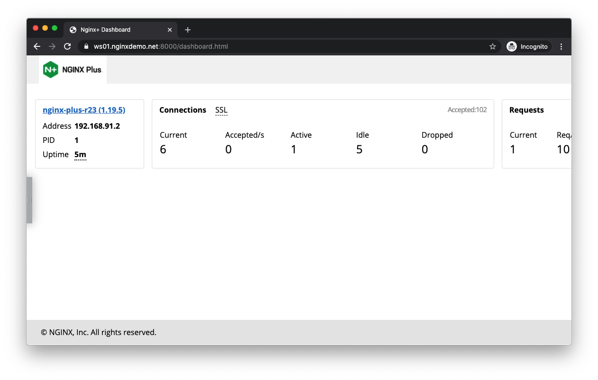
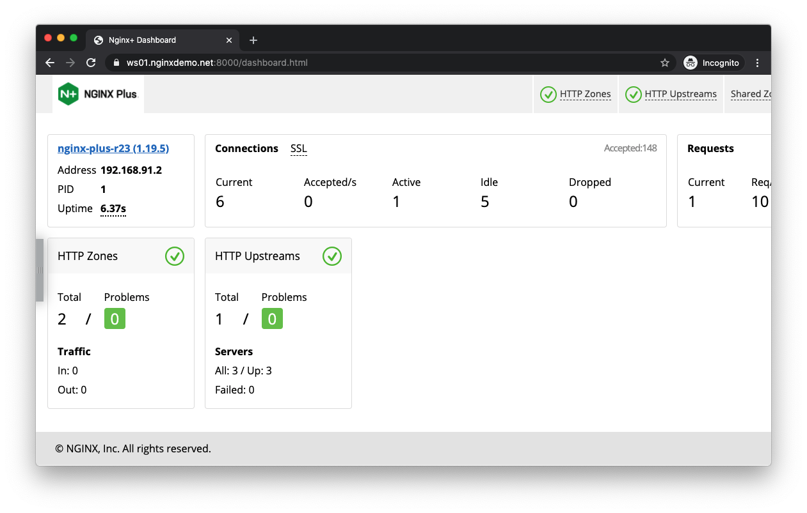

= Task 6: Uncovering Problems
:showtitle:
:toc: left
:sectlinks:
:prev_section: task5
:next_section: task7
:source-highlighter: pygments

****
<<index.adoc#,Contents>> +
<<task5.adoc#,Previous Task>> +
<<task7.adoc#,Next Task>> +
****

== 6.1 There be dragons

In the root working directory on the docker host, run `docker inspect nginxbasics_wordpress3_1 |
grep IPAddress` and make note of the IP address of the container. In my case it is 192.168.91.4.
Update the below config snippet to reflect your IP address.
Within the nginxplus/config directory, edit the default.conf file to reflect the following contents:

----
upstream wordpress {
  server 192.168.91.5; #wp1
  server 192.168.91.8; #wp2
  server 192.168.91.4; #wp3
}

server {
  listen 80;

  location / {
    proxy_set_header Host $host;
    proxy_pass http://wordpress;
  }
}
----

Make sure to reload the configuration after saving the file `docker exec nginxbasics_nginxplus_1
nginx -s reload`.
We have now added a third member to our Upstream Group named “wordpress”. We still have not
specified a load balancing algorithm, thus still defaulting to round-robin.

Point your browser at the wordpress site and be sure to reload the page a good few times.

Jumping Jehosaphat! We seem to have a failure rate of 33%!!!
No need to panic, this is an intentional "bug". The inquisitive amongst us will soon realize that I have
simply thrown an error in the index.php file of the third instance. It gives us something real-world to
work with. In our lab we are lucky; the website clearly identifies which upstream node it originated
from, so troubleshooting becomes a bit easier. In the real world though, additional steps would need
to be made to isolate where the error occurs, and even worse, is it just one upstream failing or
several? Is it failing constantly or intermittent? If only we had greater visibility into the goings on of
the NGINX Plus instance...

== 6.2 Let there be light

Within the nginxplus/config directory, create/edit the monitoring.conf file

----
$ sudo nano nginxplus/config/monitoring.conf
----

to reflect the following contents:

----
server {
  listen 8000;

  location /api {
    api write=on;
  }
  
  location = /dashboard.html {
    root /usr/share/nginx/html;
  }
}
----

Make sure to reload the configuration after saving the file

----
$ sudo docker exec nginxbasics_nginxplus_1 nginx -t
$ sudo docker exec nginxbasics_nginxplus_1 nginx -s reload
----

We now created an additional config file, within which we defined another virtual server – this time,
listening on port 8000. This virtual server is set up for monitoring purposes, specifically to expose the
NGINX Plus API and the bundled Extended Status Monitoring dashboard. Since the main config file
for NGINX Plus `/etc/nginx/nginx.conf` defines an import directive for all files ending with .conf in
the `/etc/nginx/conf.d` directory our newly created file will be included automatically.

****
When you open the API/Dashboard the gateway will ask you to authenticate. The connection to the gateway is
proxied through SSL and authenticated for security reasons. The NGINX config created above is much simpler.
The curious amongst you may want to take a look at the `/etc/nginx/` folder on the gateway at the end of this
course to see the SSL termination, and authentication settings.
****

++++

Open your browser and navigate to  and verify that you see a result similar to
this

++++

We have a status dashboard! Yet, alas, there does not seem to bee too much information in it…
This is because we have yet to tell NGINX Plus what it should be monitoring. Let us fix that next.

== 6.3 Make it Brighter

Within the nginxplus/config directory, edit the default.conf file to reflect the following contents:

----
upstream wordpress {
  zone status_wordpress 64k;
  server 192.168.91.5; #wp1
  server 192.168.91.4; #wp2
  server 192.168.91.7; #wp3
}

server {
  status_zone portEighty;
  listen 80;

  location / {
    status_zone portEighty_locationSlash;
    proxy_set_header Host $host;
    proxy_pass http://wordpress;
  }
}
----

Make sure to reload the configuration after saving the file `docker exec nginxbasics_nginxplus_1
nginx -s reload`.

What we are doing in this example is to tell the status monitoring what it should keep an eye on for
us, and we are also setting up some shared memory zones for data collection. If we return to our
web browser and reload the dashboard (it may have auto-reloaded) we should now have much
more data at hand:

Not only does the splash screen have more data; we have three additional tabs at the top right to
investigate! If we visit our web site and reload a number of times, we should be able to pinpoint
the culprit, or indeed culprits, in the HTTP Upstreams tab. Easy!

Now let's move on to <<task7.adoc#,Task 7>>

|===
|<<task5.adoc#,Previous>>|<<task7.adoc#,Next Task>>
|===
