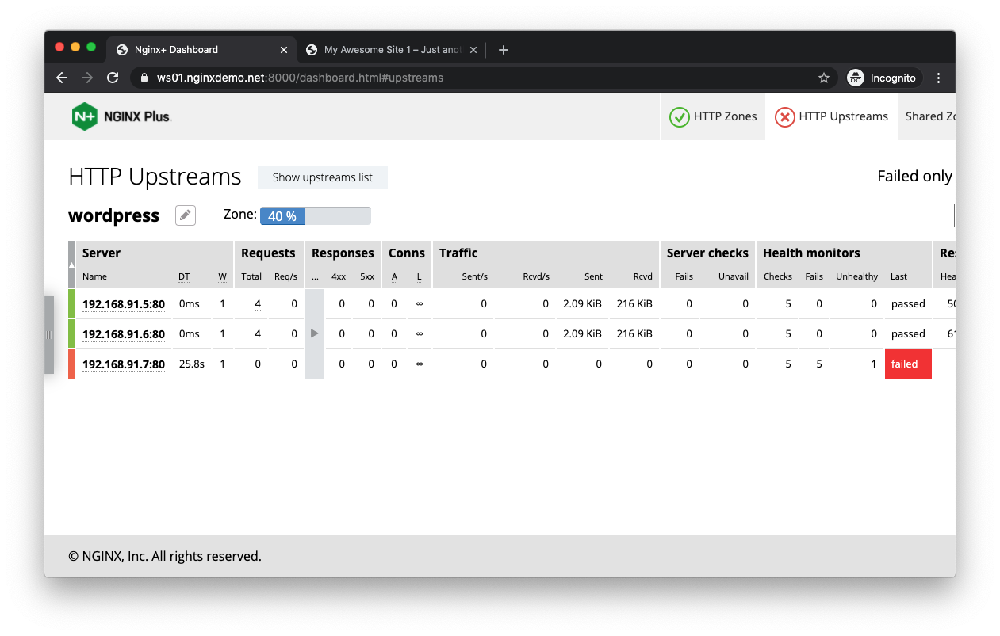
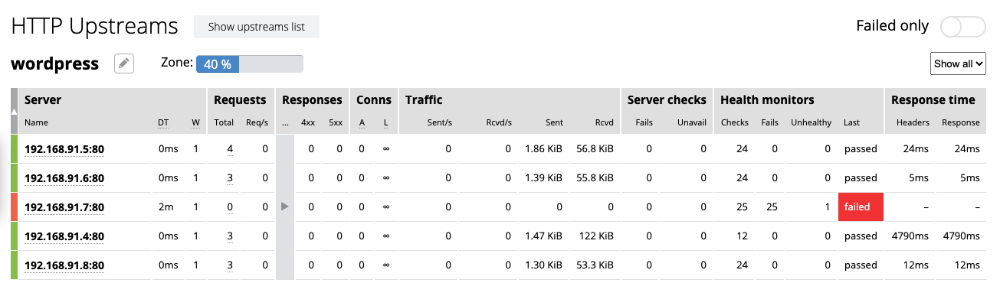

= Task 7: Finding Solutions
:showtitle:
:toc: left
:sectlinks:
:prev_section: task6
:next_section: task8
:source-highlighter: pygments

****
<<index.adoc#,Contents>> +
<<task6.adoc#,Previous Task>> +
<<task8.adoc#,Next Task>> +
****

== 7.1 A Quick Fix

We now have status monitoring, but the web site is still broken. The obvious solution is to fix the
index.php file I sabotaged, but in a real-life scenario we might have to remedy before we repair.
Luckily, since we have a load balancer in place, we have several ways of easily solving this issue.

One apparent remedy, now that we have identified the misbehaving upstream, is to simply remove
the offender from the upstream group and reload the config. This will remedy the issue, sure, but it
requires interaction both to remove it and to put it back when it is healthy. Not to mention that we
need to detect the failure to begin with before any action takes place. Would it not be better if we
could make the load balancer respond to such event on its own?

NGINX Plus has many weapons in its arsenal, and the one best suited to this scenario is its Active
Health Check capability. In simple terms, NGINX Plus can check not only if an upstream is healthy,
but it can also verify that the upstream is responding in a predictable manner. We can verify health
by looking at returned status codes, response headers, or even do regular expression matching on
the response body! The Active Health Check engine in NGINX Plus is rich and very configurable. But it
can also be super easy.

Within the nginxplus/config directory, edit the default.conf file to reflect the following contents:

----
upstream wordpress {
  zone status_wordpress 64k;
  server 192.168.91.5; #wp1
  server 192.168.91.4; #wp2
  server 192.168.91.7; #wp3
}

server {
  status_zone portEighty;
  listen 80;

  location / {
    status_zone portEighty_locationSlash;
    proxy_set_header Host $host;
    proxy_pass http://wordpress;
    health_check;
  }
}
----

Make sure to reload the configuration after saving the file `docker exec nginxbasics_nginxplus_1
nginx -s reload`.

If we now return to our web site and reload several times, we see that the
environment is healthy! Let us check with the Extended Status dashboard on the HTTP Upstreams
tab to see what is going on:

We see here that the third instance is in a failed state, and therefore it will not receive traffic. It will
remain in a failed state until it starts responding in a predictable manner again, at which time the
Active Health Check will allow for it to receive traffic again – all without human intervention.
Read more about the Active Heath Check function and its parameters here:

https://nginx.org/en/docs/http/ngx_http_upstream_hc_module.html#health_check

== 7.2 But what now?

Let us start by adding two more members to the upstream group. Use the same method to locate the IP
addresses as bfore:

----
$ docker inspect nginxbasics_wordpress4_1 | grep IPAddress
$ docker inspect nginxbasics_wordpress5_1 | grep IPAddress
----

Within the nginxplus/config directory, edit the default.conf file to reflect the following contents:

----
upstream wordpress {
  zone status_wordpress 64k;
  server 192.168.91.5; #wp1
  server 192.168.91.4; #wp2
  server 192.168.91.7; #wp3
  server 192.168.91.9; #wp4
  server 192.168.91.6; #wp5
}

server {
  status_zone portEighty;
  listen 80;
  location / {
    status_zone portEighty_locationSlash;
    proxy_set_header Host $host;
    proxy_pass http://wordpress;
    health_check;
  }
}
----

Make sure to reload the configuration after saving the file `docker exec nginxbasics_nginxplus_1
nginx -s reload`.

Return to our web site and reload many times. Did you notice anything out of
the ordinary? It seems everything kind of freezes intermittently. Let us head over to the Extended
Status Dashboard in the HTTP Upstreams tab to investigate:

Instance 4 is responding much slower than its peers. Can we fix that issue in config, I wonder? It
passes health checks because it is responding predictably. It does so excruciatingly slow though. Let
us play with load balancing algorithms next.

== 7.3 Choices, choices

Round-robin is a computationally fast algorithm. It is so due to it not requiring knowledge of only
one thing to make a load balancing decision: who is next in line? The trade-off, however, is that it is
not particularly clever. In our scenario, where we are experiencing a systems degradation of one (or
more) upstreams, either permanently as in our case (I broke it), or intermittently – we can see
tremendous benefit to the user experience by employing a smarter load balancing algorithm. It so
happens that NGINX Plus has the perfect one up its sleeve in the shape of least_time.

Within the nginxplus/config directory, edit the default.conf file to reflect the following contents:

----
upstream wordpress {
  least_time last_byte;
  zone status_wordpress 64k;
  server 192.168.91.5; #wp1
  server 192.168.91.4; #wp2
  server 192.168.91.7; #wp3
  server 192.168.91.9; #wp4
  server 192.168.91.6; #wp5
}

server {
  status_zone portEighty;
  listen 80;
  location / {
    status_zone portEighty_locationSlash;
    proxy_set_header Host "wp.nginx.local";
    proxy_pass http://wordpress;
    health_check;
  }
}
----

Make sure to reload the configuration after saving the file `docker exec nginxbasics_nginxplus_1
nginx -s reload`.

Return to our web site and reload many times. You will note that there is still
the delay on the first hit, but as the load balancer learns the response times of each upstream it will
automatically distribute traffic in a sensible fashion.

Now let's move on to <<task8.adoc#,Task 8>>

|===
|<<task6.adoc#,Previous>>|<<task8.adoc#,Next>>
|===
