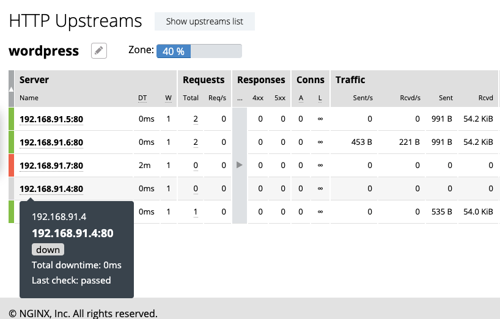

= Task 8: Basic Authentication
:showtitle:
:toc: left
:sectlinks:
:prev_section: task7
:next_section: index
:source-highlighter: pygments

****
<<index.adoc#,Contents>> +
<<task7.adoc#,Previous Task>> +
****

== 8.1 My API is exposed!

In Modules 5 and 6 we enabled the Extended Status Monitoring dashboard, but for it to function it
relies heavily on the NGINX Plus API. We enabled the API in the same modules, but we did nothing to
protect it. In a real-world scenario we would be exposed, and our attack vector would be rather
broad. Luckily, since the API is defined in a location directive, we have all the safety measures
available to any other location available to protect the API as well. Let us tie it down a bit, shall we?

****
Note: In this hosted version of NGINX Basics we're already protecting the API at the gateway, but follow
the steps here, because we'll be using a local `curl` client to test the authentication.
****

For the sake of simplicity, we will enable basic authentication. First, run the following command to
step into the shell of our NGINX Plus container:

----
$ docker exec -it nginxbasics_nginxplus_1 /bin/sh
----

Within the shell, first install apache2-utils by running this command:

----
/ # apk add apache2-utils
----

Then, let us generate a password file:

----
/ # htpasswd -c /etc/nginx/.htpasswd leif
----

You will be prompted for a password twice. Create one you will remember; no complexity
requirements are set. You can verify the created file by running this:

----
/ # cat /etc/nginx/.htpasswd
----

You should receive output similar to this:

----
/ # cat /etc/nginx/.htpasswd
leif:$apr1$6EbX9hic$mdlrC1X9lfyVtRKhxmqdQ/
----

Exit the container by typing exit followed by enter. Next, within the nginxplus/config directory,
create/edit the monitoring.conf file to reflect the following contents:

----
server {
  listen 8000;

  location /api {
    limit_except GET {
      auth_basic "NGINX Plus API";
      auth_basic_user_file /etc/nginx/.htpasswd;
    }
    api write=on;
    allow 192.168.91.0/24;
    allow 10.0.0.0/8;
    deny all;
 }

 location = /dashboard.html {
   root /usr/share/nginx/html;
 }

 location /swagger-ui {
   root /usr/share/nginx/html;
 }
}
----

Make sure to reload the configuration after saving the file `docker exec nginxbasics_nginxplus_1
nginx -s reload`.

++++

We can verify that our dashboard <a id='dash'>http://wp.nginx.local:8000/dashboard.html</a> still works fine.

++++

We can also make API requests directly, via a local curl. Example request:

[#curl1]
----
$ curl http://cicd1:8000/api/6/http/upstreams/wordpress/servers/3 
----

This gives me a JSON object that contains the settings for member 4 of my upstream group – the slow one.
What if I wanted to manipulate it, or even delete it? I can do that in config, of course, but also:

[#curl2]
----
$ curl --user "leif" --request PATCH -d "{ \"down\": true }" http://cicd1:8000/api/6/http/upstreams/wordpress/servers/3
----

Would you look at that – an authentication prompt! Let us provide our credentials and see what the
response is:

----
{"id":3,"server":"192.168.91.9:80","weight":1,"max_conns":0,"max_fails":1,"fail_timeout":"10s",
"slow_start":"0s","route":"","backup":false,"down":true}
----

It looks like we have marked or slow upstream as down. Let us check the dashboard:

Success! We have now altered config in memory, in real-time! Well done!

The eagle eyed observer will have noted that we exposed the swagger-ui for NIGNX Plus as well; you
can peruse it at http://wp.nginx.local:8000/swagger-ui.

== 8.2 Self Study (optional)

HTTPS/TLS:
https://docs.nginx.com/nginx/admin-guide/security-controls/terminating-ssl-tcp/

Caching:
https://docs.nginx.com/nginx/admin-guide/content-cache/content-caching/

== 8.3 Examine the gateway

You're also invited to peruse the gateway instance configuration to see how it's using SSL
with `letsencrypt` certificates to act as a reverse_proxy for this course.

|===
|<<task6.adoc#,Previous>>|<<index.adoc#,Home>>
|===
