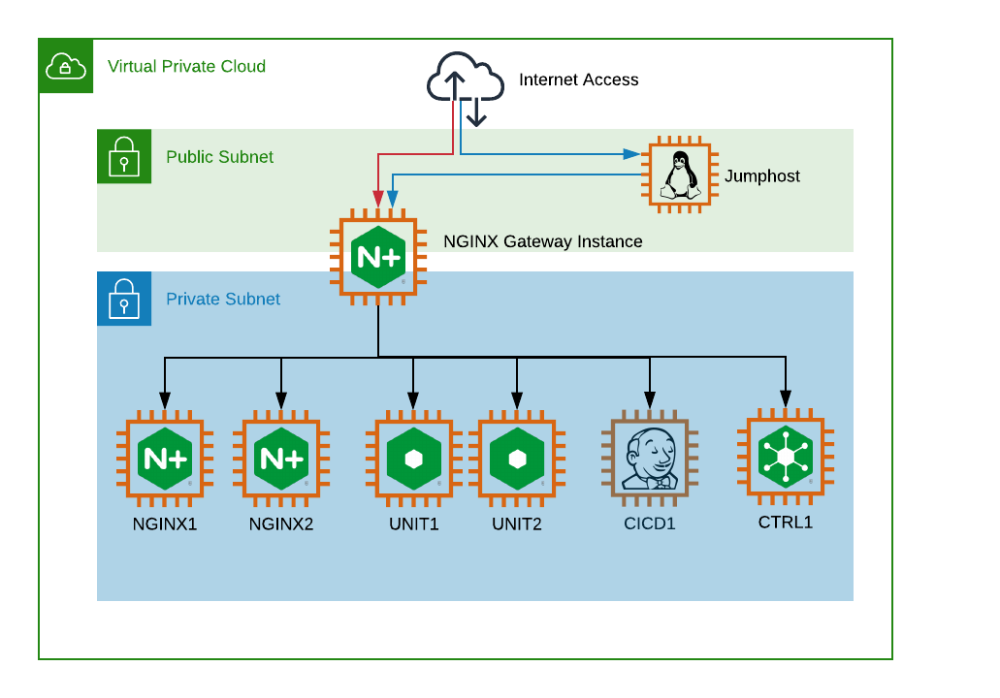

= Task 0: Welcome to the workshop
:showtitle:
:sectlinks:
:toc: left
:prev_section: index
:next_section: task1
:source-highlighter: pygments

****
<<index.adoc#,Contents>> +
<<index.adoc#,Previous Task>> +
<<task1.adoc#,Next Task>> +
****

== 0.1 Introduction

Welcome to this NGINX Application Centric Automation workshop. 

We'll start off by deploying NGINX configuration using Ansible to deploy configuration files
to the servers, later we'll move onto deploying the same files using a CI/CD pipeline, and finish up 
switching to the NGINX Controllers declarative API.

Ansible is used extensively in both the course and in the deployment of the workshop. In our first
task we'll cover Ansible basics, but first lets take a look at the environment you'll be working with.

Each individual in the workshop has been given access to a gateway instance, the gateway is multi-homed
with a public interface in a routeable public network, and a secondary inteface in a private network.

All other machines in the course reside in the private network and will be accessed through the NGINX
Plus instance running on the gateway.

If you're reading this then the gateway itself is already setup, and your instructor has supplied you
with it's hostname and password.  

== 0.2 Getting Shell Access

The private key for gaining access to your workshop can be downloaded link:/secrets/[Here]
You should find the SSH private key in both OpenSSH PEM and Putty PPK file formats.

Once you have both HTTPS and SSH access to the workshop please continue with <<task1.adoc#,Task 1>>

|===
|<<index.adoc#,Contents>>|<<task1.adoc#,Next Task>> 

