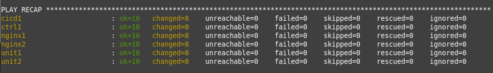

= Task 1: Familiarize yourself with Ansible
:showtitle:
:toc: left
:sectlinks:
:prev_section: index
:next_section: task2
:source-highlighter: pygments

****
<<index.adoc#,Contents>> +
<<task0.adoc#,Previous Task>> +
<<task2.adoc#,Next Task>> +
****

== 1.1 Introduction

Ansible is an automation tool from RedHat which supports agentless configuration of remote systems.
Ansible can be used on the command line to execute *"Ad-Hoc"* commands, or whole sequencies of configuration
steps can be grouped and executed together in what is known as a *"playbook"*.

The system from which you run ansible tasks is called the  *"control node"*. This system has ansible
installed locally, and it is used to execute tasks on *"managed nodes"* (also known as hosts).

The hosts do not need to have ansible installed. Ansible is agent-less. However, all of the hosts which 
are managed by the ansible control node need to be defined in your *"inventory"*. 

An inventory item can be a single host or a group of hosts.
When you execute an ansible task against a host or group in your inventory, ansible performs the operation
remotely (from the control node) using *"modules"*.

There are hundreds of ansible modules available each with a particular purpose. Ansible modules can do anything from
deploying host Operating Systems, managing users groups and files, through to managing configuration of an F5 Big-IP.

****
In this course you will be connecting to a machine running on Amazon EC2. This host is publically
accessable via SSH/HTTP/HTTPS. You will be provided a FQDN and a SSH private key for access. +
This machine is your Ansible Control Node, and your "frontend" for all other systems
****

'''
== 1.2 Running Ansible

In your home directory, you have a directory called ansible. We will be executing all of your ansible
tasks and playbooks from this location. When you execute ansible it checks for an _ansible.cfg_ file
in the local folder first, followed by various other locations, finally falling back to _/etc/ansible.cfg_.

As you've probably guessed, the ansible.cfg file we are using for this workshop resides in your
_~/ansible_ folder, and running commands outside of this folder will not work as expected.

'''
== 1.3 Review the Ansible config

The ansible.cfg file in your ansible folder contains all of the ansible defaults.
We're only setting a handful:

----
$ egrep -v "^[\[#]" ansible.cfg | sort -u
  
host_key_checking = False
inventory      = inventory
nocows = 1
remote_user = ubuntu
stdout_callback = yaml
----

We set the remote user to be _ubuntu_, so when ansible attempts to execute a command it will try to ssh
to the remote system as ubuntu. We set _nocows_ to 1, which disables cowsay, but feel free to re-enable it
if you find it comforting. We also tell ansible to use the "yaml" output plugin in _stdout_callback_,
this is so we get nicely formatted output, especially useful when things go wrong.

The inventory file can be a script to generate hosts/groups dynamically, but in our case a simple static text
file will suffice.

'''

Next we can take a look at the inventory

----
$ cat inventory
localhost
gateway
  
[controller]
ctrl1
  
 ...
  
[remote]
ctrl1
nginx1
nginx2
unit1
unit2
cicd1

[all:vars]
wsid=mb01
domain=workshop.nginxlab.net
----

Ansible uses the inventory to match hosts and groups of hosts on which to execute tasks or playbooks.
The inventory uses _"ini file"_ like syntax, and groups are indicated by surrounding them with square brackets _[]_.

Variables can also be applied to hosts, by including them after a host entry on the same line, or for a group
by referencing the group name with a `:vars` suffix. The special group `[all]` matches all hosts.

'''
== 1.4 Ansible Ad-hoc mode
Ansible allows you to execute tasks in an ad-hoc way. Try executing the following:

----
$ cd ~/ansible
$ ansible -m ping ctrl1
$ ansible -m ping nginx
----

The above command line executed the _ping_ module against the provided inventory item.
The first ping command was execute on a single host _ctrl1_, while the second was executed on
all hosts in the group _nginx_

The ansible _ping_ module is a very simple module and it simply confirms that you can connect to the
host in the inventory and execute a command. Most modules take additional arguments, try running:

----
$ cd ~/ansible
$ ansible -m copy localhost -a "src=/etc/hosts dest=/home/ubuntu/hosts"
----

The above uses the _copy_ module, which requires additional arguments. The _dest_ argumnet is mandatory
and tells ansible where to copy the given content.
The content can be read from a file in which case the _src_ argument is used. Or it may be given to
the module directly with the _content_ argument.

Here we simply copied the /etc/hosts file into your home directory.

Ansible should have output a _changed_ status because the file didn't exist before and the execution
resulted in a change. If you run the same ansible command again you will see a _success_ outcome which
indicates the module ran without error, but nothing changed in the system.

'''
== 1.5 Ansible Facts

Ansible can also gather facts about the nodes on which it executes. These facts include the
Operating System details, information on network interfaces, etc.

The facts can be collected using the setup module. Try:

----
$ cd ~/ansible
$ ansible -m setup localhost
----

You will have just seen a whole load of information flash through your console.

Fortunately the setup module has a filter argument. Try:

----
$ cd ~/ansible
$ ansible -m setup nginx -a "filter=ansible_dist*"
----

This time the results were filtered to output only facts which matched the filter. You should see
a collection of facts about the Operating System in use on the _nginx_ instances.

'''
== 1.6 Ansible Playbooks

In the previous section we used ansible to execute single tasks using the specified modules.
A more common requirement is to have ansible execute a sequence of tasks in order.
This is where a playbook comes in.

A Playbook is an ordered list of tasks to execute against a set of hosts.
It has several advantages over Ad-Hoc mode:

 * You can include variables either directly or from external sources.
 * You can use loops to perform tasks multiple times (eg iterate over a list of users)
 * You can use conditional statements to determine if a task needs to be run
 * You can start a task asynchronously and poll for completion
 * You can use other tasks from Ansible Roles.

In section 1.7 we'll look through an Ansible playbook and introduce you to the `ansible-playbook`
command.

'''
== 1.7 Finishing our configuration

The machines that you are connecting to for this workshop have all been deployed using Ansible. +
However the set up is not complete, lets finish that task now - using our new ansible skills.

Change directory to your ansible folder and take a look at the node setup playbook.
----
$ cd ~/ansible
$ less node_setup_playbook.yaml
----

Ansible configuration uses YAML extensivley. You are now looking at an ansible playbook, the three dashes
denote this is a yaml file.

[source,yaml]
----
---
- hosts: remote
  become: true
  gather_facts: yes

  tasks:
----

The `hosts` line tells Ansible on which host or group it should be applying this playbook. The `become` entry
indicates that Ansible should attept to run the command as root, and `gather_facts` tells ansible to collect
information about the hosts first.

Next follows a list of tasks for the playbook to perform. They essentially all use the same format:

[source,yaml]
----
  - name: A friendly description of the task
    module:
      module_options
      module_options
    task_options
----

Each `name` will be printed by Ansible as it runs through the playbook, and if something goes wrong, the `name`
will be used to reference where the error occurred. Each task runs an ansible `module`, which is defined on
the next line, and is usually followed by a series of `module` specific options. Finally some `task_options`
may be defined for storing output, or looping through the task multiple times, etc.

If you look through the node_setup_playbook you will see that it is doing several things on each of the
machines listed in the `remote` group of our ansible inventory `~/ansible/inventory`.

  * Add each machines hostname to it's own hostfile
  * set the machines hostname using the hostname command
  * install a script `/etc/rc.ansible` and configure systemd to run it.
  * update the apt package cache

The script Ansible is adding to each machine configures them to use your ansible controller as their 
default gateway, and to consult it for DNS. This is because your gateway is the only public machine,
and some tasks later will require them to download packages from the internet. Also there is a DNSMasq
configuration on your gateways which responds authoritatively for your workshops domain.

Let's run the playbook

----
$ cd ~/ansible
$ ansible-playbook node_setup_playbook.yaml
----

Hopefully those tasks all completed successfully, and the final output from Ansible is a _PLAY RECAP_
containing only changed and ok statuses.

With that done, we're a step closer to having a useful workshop envionment. In task 2 we'll install NGINX on the
gateway to open up access to the nodes you just configured. But before we can do that, we need to install
an ansible role to help us.

'''
== 1.8 Ansible Roles

An Ansible Role is a group of tasks and variables which have been built in a standard way to enable reuse.
It's a good way to create building blocks for performing common tasks, such as setting up
a webserver, or installing a system such as jenkins. Unlike a playbook a role is not tied to a group of hosts.

We're going to be making use of a few ansible roles during this course.

In fact we used a role during the deployment of your workshop to install NGINX onto your gateway host.
The role used was `nginxinc.nginx` which can install and configure NGINX and NGINX Plus software.
You can see the installed roles by executing the following `ansible-galaxy` command.

----
$ ansible-galaxy list
----

You can search for roles using the same command line tool or using the link:https://galaxy.ansible.com/[Galaxy website]

----
$ ansible-galaxy search nginxinc
----

Now let's move on to <<task2.adoc#,Task 2>> 

|===
|<<task0.adoc#,Previous>>|<<task2.adoc#,Next Task>>

