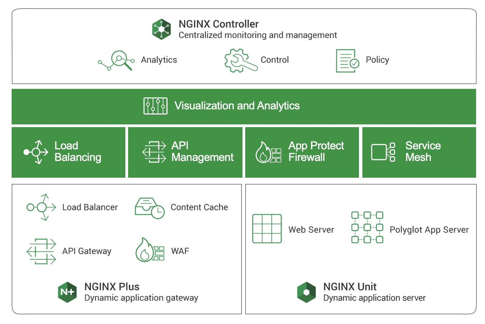

= Task 2: Deploy a simple NGINX Configuration
:showtitle:
:sectlinks:
:toc: left
:prev_section: task1
:next_section: task3

****
<<index.adoc#,Top>> +
<<task1.adoc#,Previous Task>> +
<<task3.adoc#,Next Task>> +
****

== 2.1 Introduction
In this lesson we will be getting our hands dirty by deploying your first NGINX Plus system using
Ansible.  

NGINX Plus will be installed on your gateway node, and it will act as a simple TCP/UDP gateway for  
the services being deployed during this workshop

'''
== 2.2 Check out the playbook

You'll find the playbook in _~/ansible/playbooks/nginx_workshop_gw/install.yaml_

This is similar in some ways to the _node_setup_playbook.yaml_ that we looked at in the previous lesson,
however you'll notice some pretty significant differences. This playbook is using `roles` rather
than `tasks`, and we're setting a number of variables in a new `vars` section.

----
---
- hosts: localhost
  become: true
  gather_facts: yes
  connection: local
  roles:
    - role: nginxinc.nginx
  vars:
    nginx_type: plus
    nginx_rest_api_enable: true
    nginx_rest_api_port: 4321
    nginx_rest_api_write: true
    nginx_license:
      certificate: "/etc/ssl/nginx/nginx-repo.crt"
      key: "/etc/ssl/nginx/nginx-repo.key"
    nginx_modules:
      njs: true
...
----

This playbook imports the `role` _nginxinc.nginx_ that we downloaded from *Ansible Galaxy* and provides it
with a set of `vars`. The Variables tell the role how we want NGINX configured. 

When the role is loaded, it will run through various tasks depending on which variables we have
provided in the `vars` section. As you can see we are installing NINGX Plus, enabling the REST
API on port 4321, and installing the NJS module.

TIP: The NGINX role can also install the *NGINX Controller Agent*, as well as *NGINX Unit*

'''
== 2.3 Run the install playbook

Ensure that you are in the ansible folder and apply the _nginx_workshop_gw/install.yaml_ playbook:

----
$ cd ~/ansible
$ ansible-playbook playbooks/nginx_workshop_gw/install.yaml
----

You will see Ansible skipping a lot of steps as the play book runs. This is because the role is  
capable of installing NGINX on many different Operation Systems. It only executes the tasks which  
are relevant for Ubuntu.

Once the playbook has completed, you can check that NGINX is installed by executing

----
$ sudo nginx -t
----

'''
== 2.4 What is NGINX Plus

Most people are familiar with the extremely popular NGINX Open Source project. NGINX runs most of
the worlds websites, and it is the most downloaded container on Docker Hub. You may not be aware
that NGINX also build a commercial version of NGINX which comes with additional features and an
enterprise support agreement. The commercial version is called NGINX Plus.

NGINX Plus provides many additional features in the data plane where it manages traffic, and also
includes some control plane functionality in the form of a REST API for _upstream_ management, a
key/valure store for dynamic ADC use-cases, and metrics collection.

NGINX Plus is required if you want to manage your NGINX instances with NGINX Controller, 
or utilize the NGINX App Protect WAF.

Other NGINX Plus enhancements include:

 * Service Discovery using DNS SRV or A/AAAA records
 * JWT Support for OATH2 or OpenID Connect (OIDC)
 * ModSecurity WAF
 * App Protect WAF (Based on F5s market leading WAF technology)
 * Active Application Health Monitoring
 * Cache Management API
 * High Availability
 * Live Activity monitoring dashboard
 * Dynamic Configuration

NGINX Plus is used in many organizations for ADC/Load Balancing use-cases and also API Gateway.

'''
== 2.5 Imperative vs Declarative

If we compare the two playbooks that we've looked at so far, _node_setup_playbook.yaml_ and
_nginx_workshop_gw/install.yaml_ we can see that they have very different approaches. The node setup
playbook had a set of step-by-step tasks, while the _install.yaml_ just had a set of definitions.

The first playbook uses an imperative style, and the second one uses a declarative one.
Obviously Ansible supports both approaches.

 * Imperative
 Provides a sequence of steps that need to be preformed in order to reach a desired end state.
 The caller needs a high degree of domain specific knowledge.

 * Declarative
 Describes the end state, and is not concerned with the steps required to get there.
 The steps are abstracted away from the caller. This often reduces the amount of domain
 specific knowledge required.

'''
== 2.6 Adding Additional tasks

The _install.yaml_ playbook only concerned itself with installing NGNIX using the _nginxinc.nginx_ role. +
The role abstracted away the steps required to install and setup NGINX, and provided us with a declarative
interface.

If you take a look at the _setup.yaml_ file in the same folder, you will see it's using a series of tasks
in order to get the system to a desired state. This is much more of an imperative use of ansible. First we
add the CertBot PPA to the system, then we install certbot and the NGINX plugin, we check if we've registered
certs before, and then pick either SSL enabled or disabled versions of NGINX configuration files.

----
---
- hosts: localhost
  become: true
  gather_facts: yes 
  connection: local

  tasks:

  - name: Setup the certbot repository
    apt_repository:
      repo: ppa:certbot/certbot
      update_cache: yes 

  - name: Install certbot package
    apt:
      name:
        - python-certbot-nginx

----

Ansible makes it possible to combine roles with additional tasks in a single playbook. So you can have a
combination of imperative and declarative styles in a single playbook.

'''
== 2.7 Apply the setup playbook

Again, ensure that you are in the ansible folder and apply the _nginx_workshop_gw/setup.yaml_ playbook:

----
$ cd ~/ansible
$ ansible-playbook playbooks/nginx_workshop_gw/setup.yaml
----

You now have the gateway setup and ready to provide access to the rest of the workshop servers. You should
now be able to point your web browser at your gateway and see these documents in beautiful HTML5.

++++

Try accessing your workshop -> 

++++

== 2.8 NGINX Plus Dashboard

You should also be able to access your NGINX Plus dashboard, and API using the password created and stored
in your secrets folder and the username 'nginx'. Check that now:

----
$ cat ~/secrets/basic_auth.passwd
----

And then try to access these URLs (username is nginx):

++++

Try accessing your NGINX Plus dashboard -> 

Try accessing your NGINX Plus API -> 

Try accessing your NGINX Plus Swagger Spec -> 

++++

You will notice that the dashboard has many failed backends. This is because we haven't deployed them yet, and
the active health monitoring feature of NGINX has detected them as failed.

You can keep an eye on the gateway dashboard as deploy services to ensure that they are running correctly.

'''
== 2.9 Setup the NGINX backends

Okay, so we have installed NGINX on the gateway machine and configured it to serve content from our HTML folder
and to load balance onto the services we're going to deploy later. Before moving on lets run a final playbook
to install NGINX onto our backend NGINX instances (nginx1 and nginx2). Please run:

----
$ cd ~/ansible
$ ansible-playbook playbooks/nginx_workshop_gw/install_backends.yaml
----

<<task3.adoc#,Next Task>> 

