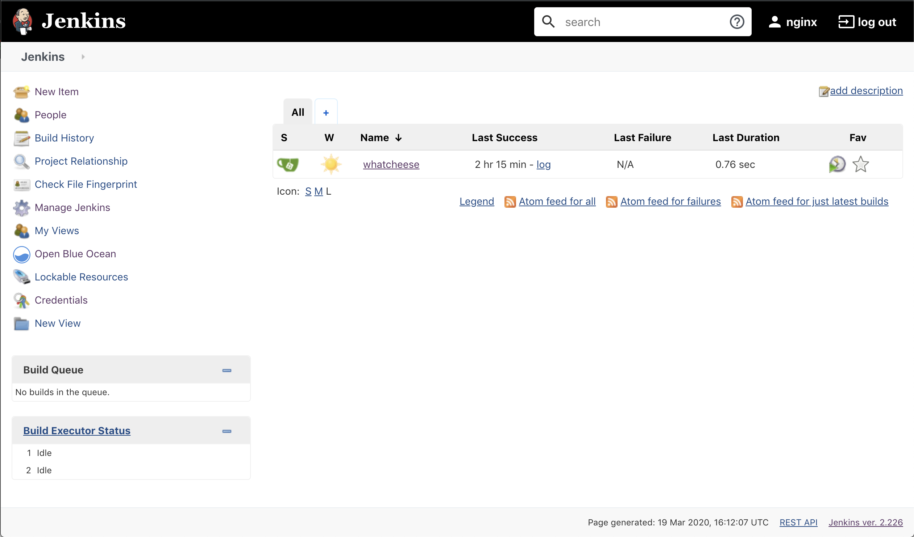

= Task 3: Deploy Your CI/CD Infrastructure
:showtitle:
:sectlinks:
:toc: left
:prev_section: task2
:next_section: task4

****
<<index.adoc#,Top>> +
<<task2.adoc#,Previous Task>> +
<<task4.adoc#,Next Task>> +
****

== Introduction

Now we're going to deploy some tools for CI/CD automation. We'll be using a free Open Source Git repository
server with a github like HTTP interface called https://gitea.io/en-us/[Gitea], and for orchestration automation
we'll be using https://jenkins.io/[Jenkins]

'''
== Install a role to help install Jenkins

----
ansible-galaxy install geerlingguy.jenkins`
----

'''
== Run the playbook

----
ansible-playbook playbooks/cicd/deploy.yaml
----

'''
== Check Gitea is running

You should now be able to access your Gitea server at `https://git.<yourdomain>`

image:img/gitea.png[Gitea]

'''
== Check Jenkins is running

You should also be able to access your Jenkins server at `https://jenkins.<yourdomain>`

<<task4.adoc#,Next Task>>

