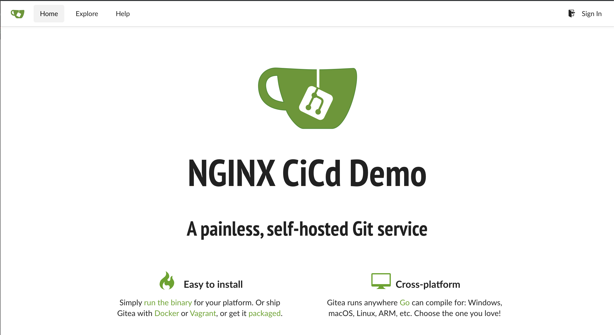

= Task 3: Deploy Your CI/CD Infrastructure
:showtitle:
:sectlinks:
:toc: left
:prev_section: task2
:next_section: task4

****
<<index.adoc#,Contents>> +
<<task2.adoc#,Previous Task>> +
<<task4.adoc#,Next Task>> +
****

== 3.1 Introduction

Now we're going to deploy some tools for CI/CD automation. We'll be using a free Open Source Git repository
server with a github like HTTP interface called https://gitea.io/en-us/[Gitea], and for orchestration automation
we'll be using https://jenkins.io/[Jenkins]

'''
== 3.2 Install Jenkins Role

Jenkins is a beast of a system with a whole bunch of plugins. We're going to use an Ansible Galaxy role to help
us get it all set up. So first install the `geerlinguy.jenkins` role on your gateway machine.

----
$ ansible-galaxy install geerlingguy.jenkins
----

'''
== 3.3 Run the playbook

Take a look at the playbook with your favourite text editor if your curious to see what it does.
The playbook is in `playbooks/cicd/deploy.yaml` and this one file covers installing the jenkins
server using the role you downloaded. Once Jenkins is installed it then includes a `gitea.yaml`
manifest in the same directory. This second manifest handles installing the gitea service.

----
$ cd ~/ansible
$ ansible-playbook playbooks/cicd/deploy.yaml
----

'''
== 3.4 Check Gitea is running

You should now be able to access your Gitea server at `https://git.<yourdomain>`

++++

Try accessing your Gitea Service -> 

++++

Check that you can login using the username _ngnix_ and the password found in `~/secrets/git.cicd.passwd`

'''
== 3.5 Check Jenkins is running

You should also be able to access your Jenkins server at `https://jenkins.<yourdomain>`

++++

Try accessing your Jenkins Service -> 

++++

image:img/jenkins.png[Jenkins]

Check that you can login using the username _ngnix_ and the password found in `~/secrets/jenkins.cicd.passwd`

'''
== 3.6 Introducing NGINX Unit

NGINX runs approximately 37% of the worlds websites, that's some 470 million sites
globally. NGINX has been in active development for many years, so when it was first
started most websites were built using static html and javascript files. 

Modern sites are much more dynamic, and NGINX has adapted over the years to be able to
execute the application run times on which they are built. However this is not optimal, and
so NGINX started developing a sister project: http://unit.nginx.org/[NGINX Unit]

=== About Unit
NGINX Unit is a lightweight dynamic open-source server for diverse web applications. 

Built from scratch, Unit can run web apps in different language versions; fully configurable
in runtime with zero interruption, it enables on-the-fly granular management for engineering
and operations.

=== Key Features

* Configuration updates dynamically via a RESTful JSON API
* Disparate language versions run simultaneously
* Application processes scale on demand
* SSL/TLS is supported seamlessly (OpenSSL 1.0.1 and later)
* Extensive request routing, load balancing, and static file serving options are available
* Server-side WebSockets are implemented for Node.js and Java
* Namespaces enable application isolation
* HTTP requests can be proxied elsewhere during routing

=== Supported App Languages

* Assembly
* Python
* PHP
* Go
* Perl
* Ruby
* JavaScript (Node.js)
* Java

=== Usage of Unit on this course

We'll be using Unit to host the backend applications which we are about to deploy using our
newly built CI/CD pipelines. You have two machines in your lab which are designated for this
task: `unit1` and `unit2`. Before we move on to deploying your first service, we'll need to
get those boxes ready.

Please run the following ansible playbook to install docker on the unit machines:

----
$ cd ~/ansible
$ ansible-playbook playbooks/unit/deploy.yaml
----

That's it, you're ready to run your first deployment pipeline.... Exciting!!!

|===
|<<task2.adoc#,Previous Task>>|<<task4.adoc#,Next Task>>
|===

