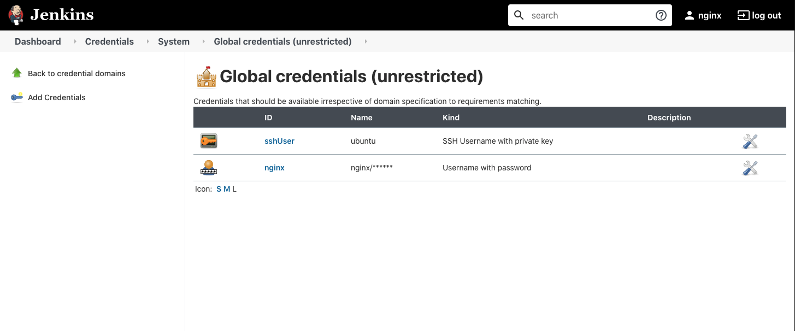
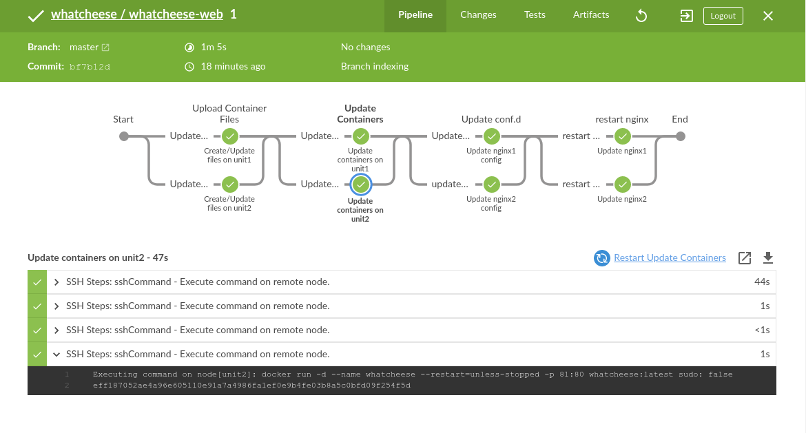

= Task 4: Manage NGINX with CICD
:showtitle:
:sectlinks:
:toc: left
:prev_section: task3
:next_section: task5

****
<<index.adoc#,Top>> +
<<task3.adoc#,Previous Task>> +
<<task5.adoc#,Next Task>> +
****

== Introduction

In this task we are going to login in to our newly deployed Jenkins automation server, and 
create a new CI/CD pipeline.

== Setup Credentials

Log into the Jenkins instance running in your workshop eg: `https://jenkins.ws99.<your_workshop_domain>` +
The username is `nginx` and the password can be found in `~/secrets/jenkins.cicd.password`

----
ubuntu@gateway:~$ cat secrets/jenkins.cicd.passwd
aGUzj4Avlh:8
----

=== Credentials for SSH access

Our first pipeline will be deploying NGINX configuration directly onto one of our NGNIX
servers. We shall acomplish this using SSH, and so Jenkins needs to be given the same
passwordless SSH access enjoyed by our ansible playbooks.

Navigate to _Credentials_ -> _Global Credentials_ and click the `Add Credentials` button.

You will need to change the `Kind` to be "SSH username with private key", and the `ID` should be set
to "sshUser". The `Username` needs to be "ubuntu", and you should copy the private key that you use
to access the workshop instances into the private key field.

Once complete, click `OK` to save.

=== Credentials for Gitea access

Jenkins also needs to be able to access our source code repositories stored in Gitea. We will need
to provide a set of credentials for that access next.

Using the same `add Credentials` dialog, set the `Kind` to be "username with password" and enter
a `username` of "nginx", and the `password` as found in `~/secrets/git.cicd.password`

Once complete, click `OK` to save.

== Connecting Jenkins and Gitea

Your Jenkins server has a Gitea plugin, which enables Jenkins to be able to enumerate Organizations
and source repositories on the Gitea server. The plugin also enables a webhook end point so that
we can automatically trigger a build pipeline when changes are commited to Git.

=== Create a Gitea reference

Login to Jenkins and select `Manage Jenkins` from the side menu, and then `Configure System` in
the management menu. Scroll down to the `Gitea Servers` section. Add a new server named "gitea"
and in the server URL you should enter `http://git.<yourdomain>:3000`

If the connection infomation is correct, then you should see a 403/Forbidden error. Click Save.

=== Create a Gitea Item

Go back to the Jenkins home page, and click `New Item`. Call the item "whatcheese" and scroll down
and select the `Gitea Organization` as the type. Click Ok

You will arrive at the new Items properties page. Scroll down to the `Projects` section. You should
see that the `Server` is linked to the server you added above. Select the Credentials we added
previously, and the owner box should set to "whatcheese". Click Save.

You will see Jenkins automatically scan the Gitea Organization, looking for Jenksinfile pipeline
configurations. Return to the Jenkins home page.

== View the Pipeline 

Navigate back to your Jenkins home page, and then follow the link in the side menu `Open Blue Ocean` +

When Jenkins searched the gitea organization of "whatcheese" it discovered a Jenkinsfile in the
whatcheese-web repository. It then automatically ran a build of whatcheese-web. That should now
be visible here.

Click on Whatcheese web and then the latest build number to view the pipeline.

Hopefully it's all green. Open a new browser window on `https://git.<your_domain>/` and login using
the username "nginx" and the same password you provided to Jenkins earlier. Find the 
_WhatCheese/whatcheese-web_ repoisitory and take a look at the Jenkinsfile. The pipeline presented
in Blue Ocean is a visual representation of the CI/CD pipeline described in this file.

== Setup an Automated Webhook

Jenkins can be set up to periodically poll Gitea for changes, but it would be better if we could
make Gitea notify Jenkins whenever a repository is updated. To do that, we need to create a webhook.

Navigate to the _WhatCheese/whatcheese-web_ repoisitory in gitea, and click the `Settings` button
on the right hand side of the menu bar. Go to webhooks and click the `Add Webhook` and then the
`Gitea` option in the drop down.

We need to tell Gitea where to send the webhook event. So in the `Target URL` field enter the
jenkins URL of your server. It should be: `http://jenkins.<yourdomain>:8080/gitea-webhook/post`

The `HTTP Method` should be set to "POST", and the `Post Content Type` should be
"application/json". The `Secret` should be blank. Click `Add Webhook`.

