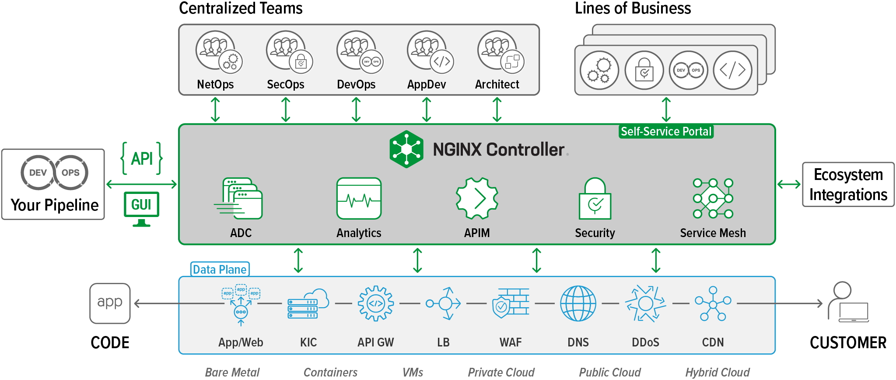
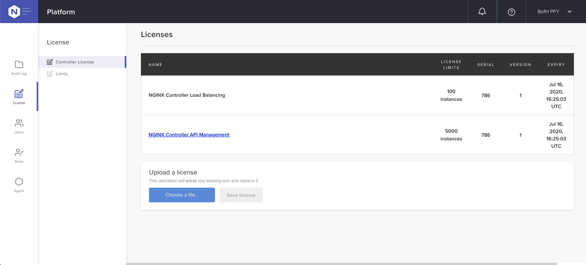
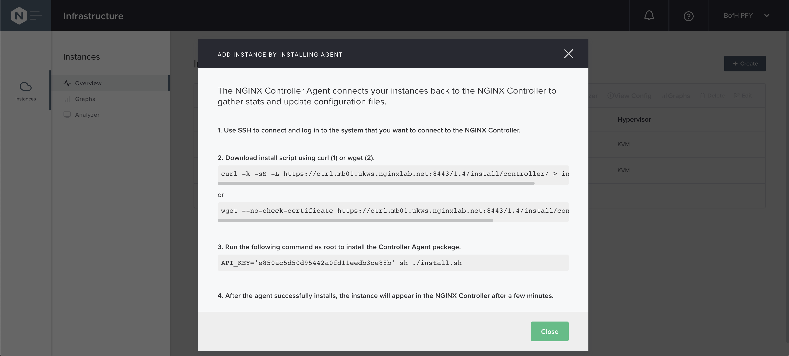

= Task 5: Setup NGINX Controller
:showtitle:
:sectlinks:
:toc: left
:prev_section: task4
:next_section: task6

****
<<index.adoc#,Top>> +
<<task4.adoc#,Previous Task>> +
<<task6.adoc#,Next Task>> +
****

== Introduction

From NetOps to DevOps, modern app teams need a self‑service, API‑driven platform that integrates easily
into CI/CD workflows to accelerate app deployment – whether your app has a hybrid or microservices
architecture – and makes app lifecycle management easier.

****
Built to manage NGINX Plus instances, NGINX Controller is cloud‑native, secure, and high‑performance.
****

In this section we'll deploy an NGINX Controller instance into your workshop, and link your NGINX instances
with your new controller. We'll also take a tour of the User Interface, and discuss the core functionality of
Controller 3.x.

'''
== Install the Controller

We're going to install NGINX Controller using an Ansible playbook. Please change to your Ansible folder, and
take a look at the variables for this deployment.

Most of the playbooks you have been using load their varibles from a common `vars` folder. The controller
playbook, will load variables from `vars/controller.yaml`. 

----
---
  controller:
    version: "3.2"
    api_version: "v1"
    hostname: ctrl.{{ wsid }}.{{ domain }}
    install_package: ~/controller-installer-3.2.0.tar.gz
    license_file: ~/license.txt
    admin_email: admin@nginx.com
    admin_password: "{{ lookup('password', '~/secrets/controller.passwd length=12 chars=ascii_letters,digits') }}"
    admin_firstname: BofH
    admin_lastname: PFY
    api_key: ''
----

The `vars` for this playbook include a version, a link to the controller installer package and a license file.
Your `admin_email` address is set to "admin@nginx.com" and the `admin_password` variable is using
a JINJA filter to generate and store a new password for you. If the password file is found to exist, then it's
content will be used instead.

Most of the varibles are used as command line switches to the installer. In a real deployment you would need
to provide details of a postgres database, and a few other parameters, but we are fudging those in this workshop.

TIP: See the https://docs.nginx.com/nginx-controller/admin-guide/installing-nginx-controller/[Controller Admin Guide]
for more information

The playbook will perform the following tasks for us:

* Install prerequisite packages (jq, curl, and a few others)
* Copy the installer to the Controller host
* execut the installer.

The command line switches used by the installer (version 3.2) can be seen by running `./install.sh --help`. The
arguments can be passed via switches or environment variables, and when neither is present the installer will
ask interactively.

The playbook will install controller using the following options

----
./install.sh -y -n --smtp-host localhost --smtp-port 25 --smtp-authentication false --smtp-use-tls false \
  --noreply-address noreply@f5.com --admin-email {{ controller.admin_email }} \
  --admin-password {{ controller.admin_password }} \
  --fqdn {{ controller.hostname }} \
  --auto-install-docker --self-signed-cert --organization-name 'F5 - NGINX' \
  --admin-firstname {{ controller.admin_firstname }} \
  --admin-lastname {{ controller.admin_lastname }} \
  --tsdb-volume-type local
----

Execute the `ansible-playbook` and read through the next section while Ansible gets everything set up for you.

----
$ cd ~/ansible
$ ansible-playbook playbooks/controller/deploy.yaml
----

=== Helper Script

To start, stop, restart, and check the status of the NGINX Controller process, use the helper.sh script found at /opt/nginx-controller/:

----
./helper.sh controller start
./helper.sh controller stop
./helper.sh controller restart
./helper.sh controller status
----

'''
== Controller Architecture

The controller platform is built using a microservice architecture. The installer sets up a local 
https://kubernetes.io[Kubernetes] cluster on the controller, and then deploys a number of containers and 
services within the K8's environment.

TIP: It is recommended that you allow the installer to installer and configure Docker and kubernetes 
for you, this is why they are not prerequisites.

The controller platform has been designed to be "API first" to enable the best integration coverage for
CI/CD orchestration. The API itself is declarative and Application Centric. Role Based Access Control
enables teams to be given access to the Applications they care about, and restricted or no access to the
ones they don't. The API is intuitively App Centric to enable developers to build logical pipelines easily,
and the analytics which controller collects are equally Application focused.

Currently the controller has three core modules:

* <<_anaytics,Analytics>>
* <<_api_management,API Management>>
* <<_load_balancing,Load Balancing>>

=== Analytics
The controller can be used as an analytics engine, either from an infrastructure perspective when not
managing NGINX configuration, or with an Application focus when used for ADC and/or API Management.

Controller can also provide valuble insights into NGINX based Service Mesh deployments.

=== API Management
The API Management module enables controller to act as a central management point for all of your
enterprises APIs. It supports Authentication, and Authorization of API consumers. It can import and
publish APIs from OAS 3.0 specifications, and can be used to manage a Developer Portal.

The APIM module has been designed to manage your full API life-cycle with an Application Centric
interface, and API first design.

=== Load Balancing
The Load Balancing module enables the central management of Load Balancer configuration for all of your NGINX+
deployments.

=== Coming Soon
WAF Module and Service Module coming summer 2020

TIP: Once the controller is running, all documentation can be accessed at https://<fqdn>/docs/

'''
== Controller Licensing

When the ansible playbook has finished, please log into your controller at https://ctrl.<your_workshop>/ using
the email address `admin@nginx.com` and the password as saved in `~/secrets/controller.passwd`

You should see a warning that the controller is not yet licensed. There is a license file in the home folder
of your gateway machine, you can either upload it manually through the UI, or use Ansible to apply the license.

If you are using Ansible, you will find a `license.yaml` in the same location as the `deploy.yaml` run previously.

The NGINX button in the top left of the screen is the main navigation control for the UI. The licenses are in the
`platform` section, along with the RBAC settings (Users and Roles), and the audit log.

'''
== Controller Agent

In the UI if you click the NGINX Button and change to the `Infrastructure` section, you will see a pop-up advising
you how to add an NGINX Plus instance.

As with the licensing above, there is an ansible playbook in the controller folder which can deploy agents to
your two NGINX Plus instances, you can either run the `deploy_nginx.yaml` playbook. Or follow the instructions
in the UI to install a controller agent onto both `nginx1` and `nginx2`.

<<task6.adoc#,Next Task>>
