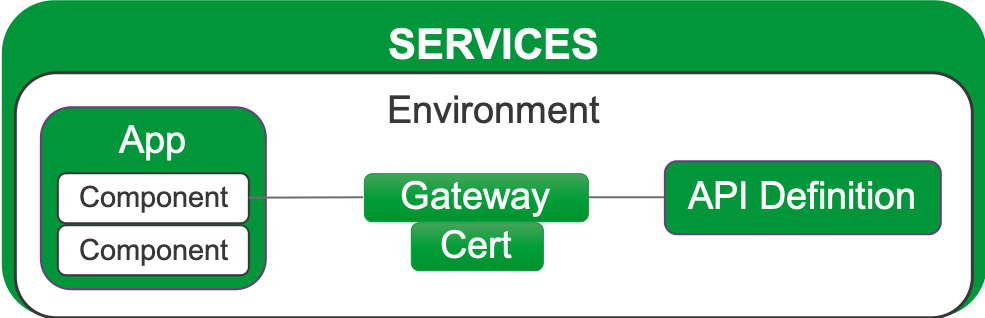
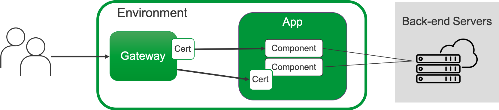
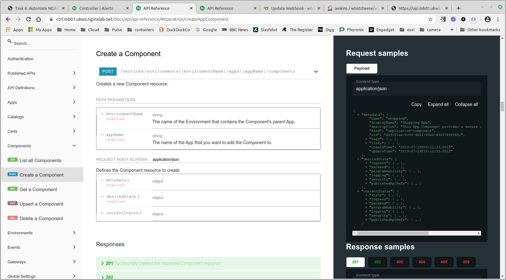
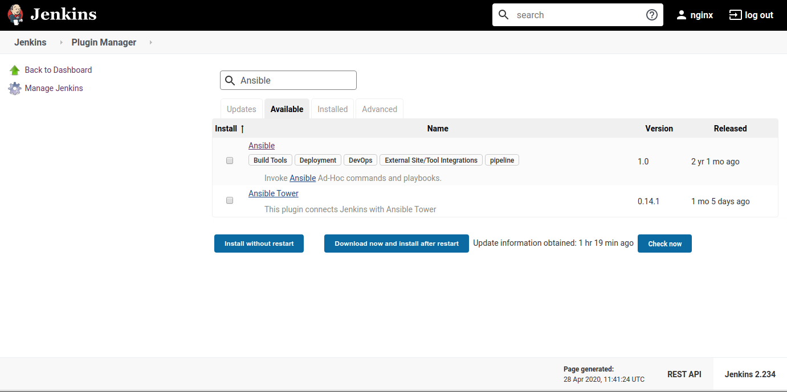
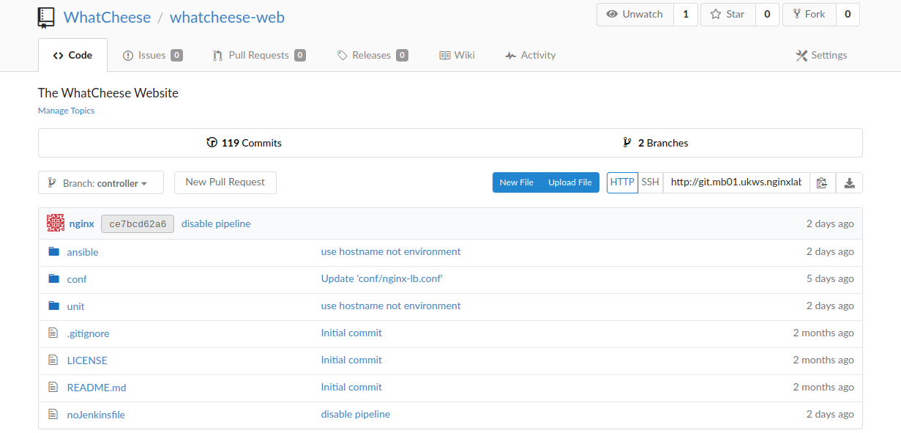
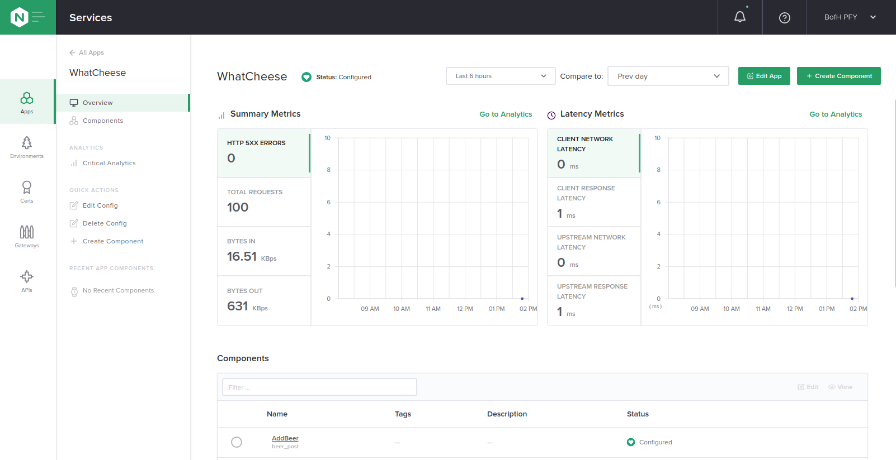
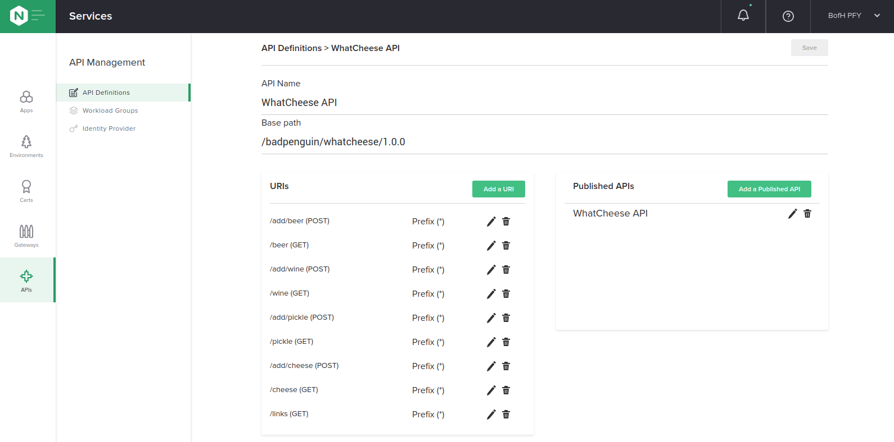

= Task 6: Automate NGINX with CI/CD and Controller
:showtitle:
:sectlinks:
:toc: left
:prev_section: task5
:next_section: task7

****
<<index.adoc#,Contents>> +
<<task5.adoc#,Previous Task>> +
<<task7.adoc#,Next Task>> +
****

== 6.1 Introduction

In the previous sections we setup Jenkins with our demo sites git repository, and we created
a webhook on the git repository to poke Jenkins whenever a change was committed to git. Jenkins 
executed the pipeline configured in the `Jenkinsfile` whenever a deployment was triggered.

The `Jenkinsfile` used previously was simply using SSH to connect to the remote machines
and then either copying files in to place or executing commands. Jenkins has a huge repository
of plugins whch help it accomplish these tasks. The SSH tasks were performed by the
https://plugins.jenkins.io/ssh-steps/[SSH Pipeline Steps] plugin.

In this section we're going to manage the NGINX Load Balancing configuration with NGINX Controller.

'''
== 6.2 The Controller API

NGINX Controller follows an “API-first” approach, which means that all NGINX Controller functionality
is exclusively exposed through declarative and resource-oriented APIs. Even the user interface (UI) uses
our REST API!  
You’ll find examples of REST request bodies in the UI. You can rest assured that the example you see is
correct, because that is the call that the UI is going to make to apply your requested configuration.

=== Object Model

The NGINX Controller API - as well as the UI and the product documentation - is organized 
into four top-level areas:

 * Analytics: Enables data visualization for NGINX Controller.
 * Infrastructure: Lets you manage your NGINX Plus instances and certain aspects of the host machines on 
   which NGINX Controller and NGINX Plus instances run.
 * Platform: Lets you manage NGINX Controller options and configurations, including Users, Roles, Licenses,
   and Global Settings.
 * Services: Lets you manage your applications and APIs.

The diagrams below demonstrate how the different objects at the Service level relate to each other.
All Service objects are part of an Environment:

Gateways and Certs can be defined at the Environment level -or- at the App Component Level. 
The diagram below shows an example of how traffic flows through a Gateway to the App Components that 
represent your application’s back-end servers. Certs can be added to the Gateway or to an App Component.

=== Resource Properties

All NGINX Controller API resources contain the following properties:

----
{
  "metadata": {
  },
  "desiredState": {
  },
  "currentStatus": {
  }
}
----

The `desiredState` property is a representation of the state that you want to apply to the system.
The properties within `desiredState` are the API representation of data. While changes to `desiredState` may
trigger eventually consistent operations, the object itself is “immediately consistent”. Consumers of the API
can “read their own writes” and should always be able to retrieve the current desired state, no matter 
where the system is in the process of applying the state change.

The `currentStatus` property represents the current state of the system. Its purpose is to communicate the
progress of achieving eventual consistency to the API consumer. As such, currentStatus is a read-only property.

'''
== 6.3 Browse the Controller API

++++

The API is fully documented on the NGINX Controller. 

++++

It's worthwhile spending a few minutes browsing the API documentation to see how applications and
components are created. We're not going to be talking to the API directly, we'll use Jenkins with
Ansible to make the API calls, but it's important to understand that these are the calls that are
happening in the background.

'''
== 6.4 Jenkins, Ansible, and Controller

In order to make a change through controller you make a write call to the REST API providing the `desiredState`
that you want to see implemented. If your request is valid, the controller will accept the change and set about
the task of making it happen.

There are various ways we could talk to the controller API, but in this course we're going to use an Ansible
playbook which has been configured to take a service represented in YAML format and convert that service 
description into a number of API calls.

You can see an example service definition and playbook in your ansible folder on the gateway.

----
$ cd ~/ansible
$ less envs/f1_prod.yaml
----

The example above is for an F1 API hosted at ergast.com, and it defines an OAS3 (OpenAPI Spec v3) definition
which is in `~/ansible/specs` and goes on to define the environment. An excerpt from the envs file is below:

[source,yaml]
----
envs:

  f1_prod:
    config:
      metadata:
        name: f1_prod
        displayName: "F1 [ Production ]"
        tags: []
      desiredState: {}

    # Certificates:
    certs:
      ergast.nginx:
        config:
          metadata:
            name: ergast.nginx
          desiredState:
            type: PEM
            publicCert: "{{ pem.public[ 'ergast.nginx' ] | default('') }}"
            privateKey: "{{ pem.private[ 'ergast.nginx' ] | default('') }}"
            caCerts: "{{ pem.chain[ 'ergast.nginx' ] | default([]) }}"

    gateways:
      nginx_gw:
        config:
          metadata:
            name: nginx_gw
          desiredState:
            ingress:
              uris:
                "http://api.mb01.ukws.nginxlab.net": {}
              placement:
                instanceRefs:
                  - ref: "/infrastructure/locations/unspecified/instances/2"

----

The playbook which processes this yaml is in `~/ansible/playbooks/apps/deploy_application.yaml`. When
executed it runs through several code blocks, setting up the _environment_, setting up the _application_,
setting up the _components_, etc.

There is a similar configuration file stored in the whatcheese-web git repository. It implements the
*WhatCheese API*

In a moment we're going to get Jenkins to deploy the WhatCheese API with controller, but first we have
to enable Jenkins to run Ansible.

'''
== 6.5 Configure Jenkins to use Ansible

We have a new `Jenkinsfile` which uses the https://plugins.jenkins.io/ansible/[Ansible
Plugin], but we first need to install Ansible onto the machine running jenkins. To do that, run:

----
$ ssh cicd1
$ sudo apt-get install python3-pip
$ sudo pip3 install ansible
----

Once Ansible is installed the next step is to install the Jenkins plugin. In your browser, navigate
to `Manage Jenkins` -> `Manage Plugins` and change to the `Available` tab and search for `Ansible`

Select the `Ansible` plugin and then click `Download now and install after restart`. On the next
screen tick `Restart Jenkins when installation is complete and no jobs are running`. Jenkins should
download the plugin and then restart.

'''
== 6.6 The WhatCheese API

Take a look at your gitea server and the whatcheese-web repository. You should see that the summary box
tells you there are `nn commits` and `2 Branches`. Beneath the summary it says `Branch: master`, clicking
on that link will allow you to switch to the other branch `Branch: controller`.

You'll see that this branch has a `ansible` folder, inside which is a `envs/cheese_prod.yaml` file which
defines our service for controller, and also a `specs/whatcheese.yaml` file which is an OAS 3 document
describing the whatcheese API.

In the root of this branch is a file called `noJenkinsfile`. This is a pipeline file, but it's hidden from
Jenkins because it doesn't have the correct name. Inside the file it still has tasks to deploy the site
on unit, but this version includes an API. And the NGINX deployment no longer writes nginx configuration
files to disk, instead it runs Ansible to talk to controller.

This is the stage in question:

----
stage('Ansible deploy to controller') {
  parallel {
    stage('Run Playbook') {
      steps {
          ansiblePlaybook(
            playbook: 'ansible/playbooks/deploy-application.yaml',
            hostKeyChecking: false,
            disableHostKeyChecking: true,
            credentialsId: 'sshUser',
            inventoryContent: inventory
          )
      }
    }
  }
}
----

== 6.7 Deploy the new branch

If you checked out the repository using _git_ ealier, then you can switch branches and rename the
`noJenkinsfile` by running:

----
$ cd ~/source/whatcheese-web
$ git checkout controller
$ mv noJenkinsfile Jenkinsfile
$ git add noJenkinsfile Jenkinsfile
$ git commit -m "enable pipeline"
$ git push origin controller
----

If you didn't you can edit the `noJenkinsfile` in your web browser, and simply rename it to `Jenkinsfile`

Switch to your Jenkins server, and you should see it's running the pipeline from your controller branch. Also
keep an eye on the "Services" section of your NGINX Controller, you should see an API Spec appear under `APIs`
and an `environment`, followed by an `application` and finally the application `components`.

== 6.8 Take a look around

In the Apps section you will see new `WhatCheese` and `WhatCheeseAPI` applications, which have several
components. The `web` component in `WhatCheese` is the old website which we had deployed previously, 
and there are also several other components in `WhatCheeseAPI` for each API Service, including `cheese`,
`pickle`, `wine`, `beer`, and `links`, they all relate to the Cheese API imported from its OAS3 spec.

You can see the API endpoints in the `APIs` section.

In this area there's also an `Identity Provider` section which contains an _API Key_ based IDp configuration. 
All of the POST endpoints in the WhatCheese API are protected by the `Whatcheese Admin Keys` identity provider.
The NGINX Controller also supports JWT authenication for OAUTH2 and OIDC authentication.

In the next section we're going to generate some load again, and take a look at the analytics the controller
can provide.

|===
|<<task5.adoc#,Previous Task>>|<<task7.adoc#,Next Task>>
|===

