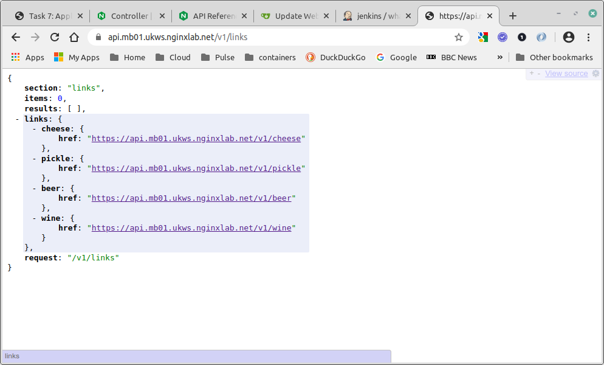
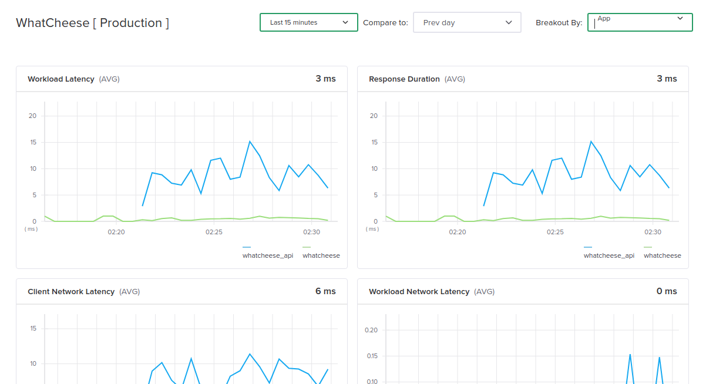
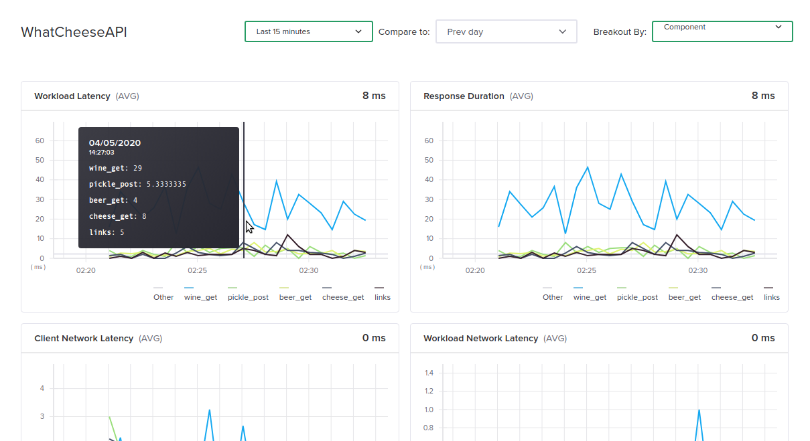
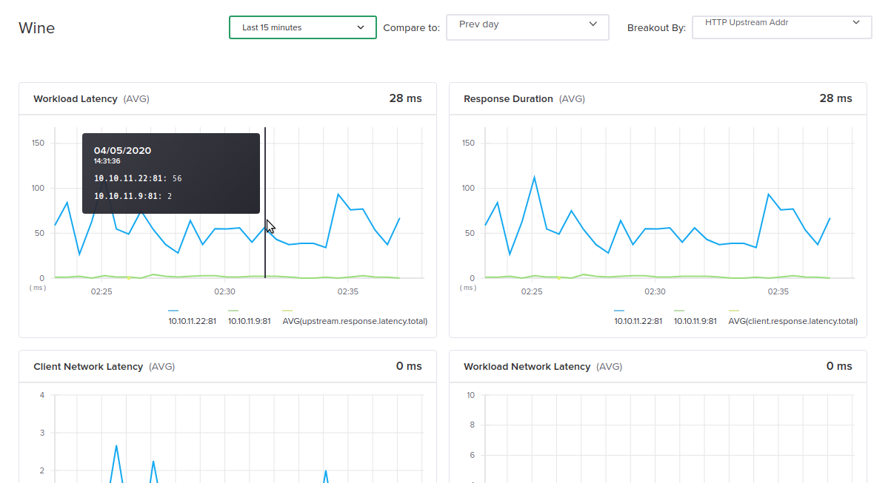
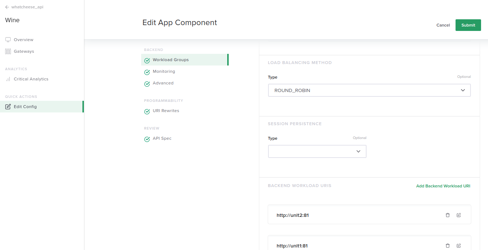
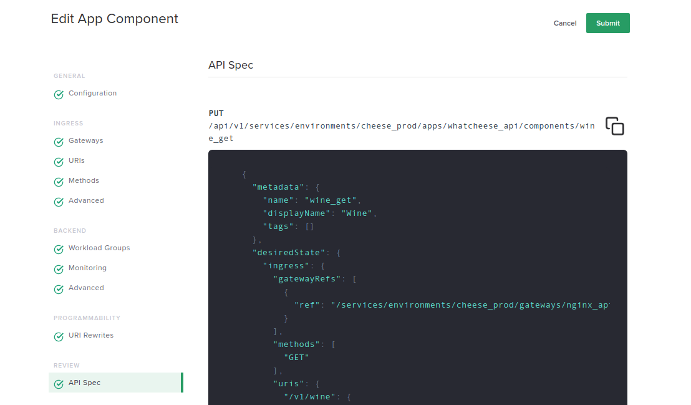

= Task 7: Application Insights
:showtitle:
:sectlinks:
:toc: left
:prev_section: task6
:next_section: task8

****
<<index.adoc#,Contents>> +
<<task6.adoc#,Previous Task>> +
<<task8.adoc#,Next Task>> +
****

== 7.1 Generate some load

In this section we're going to have a look at the _Application Centric_ metrics that the controller is
collecting. So first we need to generate some load, we'll use "siege" to do this. Run the following
command from your gateway node.

----
$ siege -f ~/siege-full.txt -i -d 5 -c 10 -v
----

=== Browse the API

While siege is generating traffic also have a poke around the website in your browser. You should notice
that the API link in the menu now works, it links to `https://api.<fqdn>/v1/links` which is the `API links`
component in your `whatcheese_api` application.

Try the following to see how the application and component configuration affects the result

++++

Try accessing the root of your API service ->  
It should return a <code>404 - Not Found</code>. The API only has endpoints 
defined that appear in the OAS spec.

Try accessing one of the product addition pages ->  
It should return a <code>405 - Not Allowed</code>. The add pages only specify
POST as a valid method.

++++

Let's expolore a little deeper using curl. You have already send a `GET` request to `/v1/add/cheese`
and received a `Method not allowed` in response, so lets send it a `POST`...

----
$ curl -vv -X POST https://<api fqdn>/v1/add/cheese
----

This POST should have returned a `401 - Authorization Required` because the addition endpoints are
protected by API Key aswell. We can send the API key using the curl command below:

----
$ curl -vv -X POST https://<api fqdn>/v1/add/pickle?psk=e849b3f640a6740683f9012b097208bc -d '{"name":"piccalilli", "country":"England", "description":"Piccalilli or mustard pickle is a British interpretation of South Asian pickles, a relish of chopped pickled vegetables and spices; regional recipes vary considerably."}'
----

This POST should succeed and add a new `pickle` to the API. The controller configuration is set to expect
an API key to be passed in a query string variable called `psk`. The `-d` argument posted the quoted JSON to the
API, which should have resulted in _piccalilli_ being added.

'''
== 7.2 Application Metrics

Now that siege has been running a while we can view the metrics that controller has been collecting
about out environment. Navigate to the `WhatCheese [Production]` environment in your services.
Change to the `Critical Analytics` view and then view the last `15 minutes` of data, and break out by
`App`.

We can see the traffic is split between the two applications, but the top left graph is showing the
`workload latency` and clearly indicates that the `whatcheese_api` has a much higher latency than
the `whatcheese` website.

Scrolling down shows us more metrics, such as `Network Latency`, `Time to First Byte`, `Bytes In`,
`Bytes Out`, `HTTP Requests` and more. These charts also show us that the website is having more
hits, and also transferring more data.

=== Investigate the API Latency

If you change to the `Apps` section in the left hand menu, and then look at the `WhatCheeseAPI`
application we can see `Critical Analytics` for only this section. Take a look at the same 
`15 minutes` window, but this time set the break out by `component`

That's interesting the `win_get` component has significantly higher latency than the other parts
of the API. We can investigate further by limiting our analytics to just that component. Still
under the `Apps` section, click components in the sub menu, and then open the `Wine` component.

Take a look at the same `15 minutes` window and break out by `HTTP Upstream Address`.

Ah - So one of the application servers is significantly slower than the other. This is causing a
degredation in service. Unsurprisingly this is intentional. The unit2 server is intentionally
adding a delay into it's responses for `/v1/wine` API calls.

== 7.3 Modify the Component

We could "fix" the problematic unit server and republish the fixed code. The problem exists in 
the PHP application `/unit/html/api/v1/index.php` within the controller branch of the whatcheese-web
application. 

We're going to temporarily resolve the issue, by modifying the component and removing `unit2` from
service. From the `Critical Analytics` screen for the win component you can click `Edit Config` in
the submenu.

In the edit screen, open the `Workload Groups` section and edit the `unit` group. Scroll down and
delete `unit2:81` from the group and click done.

Open the `API Spec` section, this is the API call which the UI is going to make when you press
submit. The `uris` section of the JSON payload should now just have a single unit backend.

Click the submit button. In a few minutes the workload latency for this component, the application
and the environment should start to drop. 

== 7.4 Fix the PHP (optional)

If you're the type of person who needs to pull at a loose thread when you see one, then feel free
to fix the PHP application and bring `unit2` back into service. Simply edit the PHP file, and
remove lines 79-82

----
  if ( $segments[2] == "wine" and $unit == 'unit2' ) {
    # sleep for 25ms on wine requests
    time_nanosleep(0,25000000);
  }
----

When your changes are commited, a Jenkins pipeline will start and redeploy the application.

|===
|<<task6.adoc#,Next Task>>|<<task8.adoc#,Next Task>>

